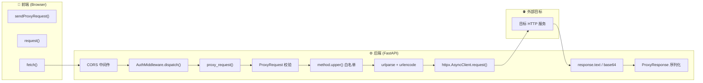

# POST /api/v1/proxy 调用链分析报告

> 生成时间: 2025-06-20
> 分析工具: `/analyzer/trace` (AST 静态分析) + 人工审查

---

## 1. 路由信息

| 字段 | 值 |
|------|-----|
| 方法 | POST |
| 完整路径 | `/api/v1/proxy` |
| 处理器 | `proxy_request` |
| 文件 | `src/mix_agent/api/v1_proxy.py:52` |
| 鉴权 | AuthMiddleware (开发模式放行) |
| 标签 | proxy |

---

## 2. 泳道图 (Mermaid)



---

## 3. 完整调用链 (前端 → 后端 → 外部)

### 3.1 前端层 (`frontend/src/api/client.ts`)

| 序号 | 方法 | 行号 | 说明 |
|------|------|------|------|
| 1 | `sendProxyRequest(req)` | 743 | 入口：封装 ProxyRequestBody |
| 2 | `request<ProxyResponseBody>("/proxy", ...)` | 3 | 通用请求函数 |
| 3 | `fetch("http://localhost:8000/api/v1/proxy", ...)` | 16 | 浏览器 HTTP 请求 |
| 4 | `AbortController` 超时控制 | 13 | 默认 30s 超时 |
| 5 | `res.json()` 解析响应 | 26 | 返回 Promise\<T\> |

### 3.2 中间件层 (`src/mix_agent/main.py`)

| 序号 | 中间件 | 方法 | 说明 |
|------|--------|------|------|
| 1 | CORS 中间件 | `CORSMiddleware` | 检查 Origin ∈ CORS_ORIGINS |
| 2 | 鉴权中间件 | `AuthMiddleware.dispatch()` | API_AUTH_TOKEN 为空时放行 |

### 3.3 后端 Handler (`src/mix_agent/api/v1_proxy.py`)

| 序号 | 方法/操作 | 行号 | 说明 |
|------|-----------|------|------|
| 1 | `ProxyRequest` Pydantic 校验 | 25-34 | 自动校验 method/url/headers/body/timeout/verify_ssl |
| 2 | `getattr(settings, "ENABLE_PROXY", True)` | 62 | 功能开关检查 |
| 3 | `req.method.upper()` | 65 | HTTP 方法白名单校验 |
| 4 | `dict(req.headers)` | 70 | 请求头合并 (content_type 优先) |
| 5 | `urllib.parse.urlparse(url)` | 78 | 解析目标 URL |
| 6 | `urllib.parse.parse_qs()` | 82 | 解析已有查询参数 |
| 7 | `urllib.parse.urlencode(merged)` | 90 | 合并 query_params (用户传入优先) |
| 8 | `urllib.parse.urlunparse()` | 91 | 重组完整 URL |
| 9 | `time.perf_counter()` | 93 | 高精度计时起点 |
| 10 | `httpx.AsyncClient(timeout=..., verify=...)` | 96 | 创建异步 HTTP 客户端 |
| 11 | `client.request(method, url, headers, content, follow_redirects=True)` | 97-103 | ⭐ 实际发出 HTTP 请求 |
| 12 | `response.text` | 108 | 文本解码响应体 |
| 13 | `base64.b64encode(response.content)` | 112 | 二进制回退方案 |
| 14 | `ProxyResponse(ok, status, headers, body, timing_ms)` | 114-121 | 构造统一响应 |

### 3.4 异常处理

| 异常类型 | 行号 | 返回内容 |
|----------|------|----------|
| `httpx.TimeoutException` | 123-129 | `ok=false, error="请求超时 (Xs)"` |
| `httpx.ConnectError` | 130-136 | `ok=false, error="连接失败: {e}"` |
| `Exception` | 137-142 | `ok=false, error="请求异常: {e}"` |

---

## 4. 涉及的数据结构

| 结构 | 定义位置 | 字段 |
|------|----------|------|
| `ProxyRequest` | v1_proxy.py:25 | method, url, headers, query_params, body, content_type, timeout_seconds, verify_ssl |
| `ProxyResponse` | v1_proxy.py:37 | ok, status, status_text, headers, body, timing_ms, error |

---

## 5. 数据库表

**此接口不涉及任何数据库操作。**

`proxy_request()` 是纯代理转发函数，仅调用：
- `httpx.AsyncClient` (外部 HTTP)
- `urllib.parse` (标准库 URL 处理)
- `time`, `base64` (标准库)

---

## 6. AST 自动分析原始结果

```json
{
  "ok": true,
  "entry_point": "POST /proxy",
  "route_info": {
    "method": "POST",
    "path": "/proxy",
    "handler": "proxy_request",
    "file_path": "src\\mix_agent\\api\\v1_proxy.py",
    "line_number": 52,
    "has_auth": false
  },
  "call_chain": [
    {"name": "proxy_request", "kind": "route", "file_path": "src\\mix_agent\\api\\v1_proxy.py", "line_number": 52}
  ],
  "tables": [],
  "swimlane": "flowchart LR\n    subgraph client[...]\n        CLIENT[\"POST /api/v1/proxy\"]\n    end\n    subgraph route[...]\n        proxy_request[\"proxy_request\"]\n    end\n    CLIENT --> proxy_request",
  "summary": "入口: POST /proxy | 涉及表: (无) | 调用深度: 1 | 触达数据库: 否"
}
```

---

## 7. 分析方法

1. **grep 全仓库搜索** `proxy`, `/api/v1/proxy` → 定位 `v1_proxy.py` + `main.py` + `client.ts`
2. **codegraph context** 追问调用链 → 获取符号级关系
3. **read_file** 完整读取 `v1_proxy.py` → 逐行追踪 handler 内部方法
4. **横向扫描** `main.py` 中间件注册、`auth_middleware.py`、`config.py`
5. **前端追溯** `client.ts` 中 `sendProxyRequest → request → fetch`
6. **调用 `/analyzer/trace`** → 自动化 AST 追踪 (source_root="src")
7. **人工合并** 前端 TS 链 + 后端 Python 链 → 三泳道图
