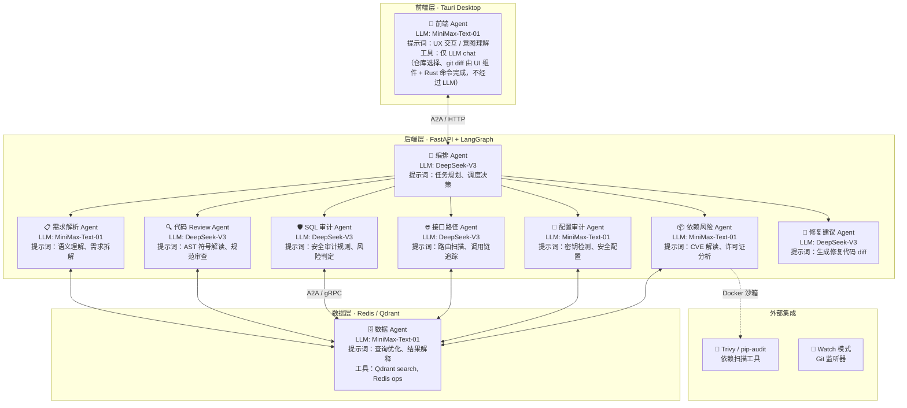

# mix-agent 企业级多智能体代码安全审计协同系统

## 项目需求文档

| 版本 | 日期 | 作者 | 说明 |
|------|------|------|------|
| V1.0 | 2026-06-18 | — | 初稿 |

---

## 1. 项目背景

### 1.1 行业痛点

在企业级软件开发流程中，代码安全面临四个层面的系统性挑战：

#### 痛点一：代码变更的安全审查跟不上迭代速度

- **ORM 风险不可见**：现代项目 90% 的数据库操作走 ORM（SQLAlchemy、MyBatis-Plus、Prisma），开发人员遗漏 `filter()` / `where()` 条件即可触发全表更新或删除，传统静态扫描工具（SonarQube、Checkmarx）基于正则匹配无法识别链式调用的语义缺失
- **人工 Review 成本高**：一个中型 MR 可能涉及 50 个文件、2000 行变更，靠人工逐行审查 SQL 风险和逻辑缺陷，一名资深工程师需要 2-3 小时，且容易在重复劳动中产生漏检
- **安全与效率矛盾**：严格的安全审查流程拖慢交付节奏；跳过审查则隐患进入生产

#### 痛点二：LLM 直接分析源码的可行性障碍

- **Token 成本爆炸**：将 10 万行源代码送入 GPT-4o 单次消耗 200 万 Token（约 $5），对于日均 10 次审计的企业场景，月成本超过 $1500
- **源码泄露风险**：将完整代码资产通过第三方 API 传输，金融、医疗、军工等行业存在合规红线
- **长上下文精度衰减**：LLM 在超过 10 万 Token 的上下文中，对具体代码片段的逻辑判断准确率显著下降

#### 痛点三：零散工具链缺乏统一编排

- **工具孤岛**：静态分析（Tree-sitter/SonarQube）→ 一份报告；SQL 扫描（SQLGlot）→ 另一份控制台输出；依赖漏洞（Trivy）→ 第三份 JSON；合规检查 → 第四套规则引擎。每个工具独立运行，结果分散，无法形成统一的代码安全画像
- **无上下文关联**：同一次代码变更引发的 SQL 风险、配置缺陷、依赖漏洞之间可能存在因果链（如引入了一个新 ORM 调用 + 未加鉴权的 API 路由），但各工具独立分析时无法关联
- **知识无法沉淀**：每次审计的结论在任务结束后被丢弃，下一次遇到相似的代码模式仍需重头开始

#### 痛点四：接口调用路径的安全盲区

- **鉴权缺失难发现**：一个新增的 API 路由如果没有加鉴权装饰器，传统 SAST 工具不会报警，因为代码"本身没有问题"——问题在于缺失
- **数据流不可追踪**：用户输入 → 参数校验 → 数据库查询之间的完整链路，代码中通常是跨文件、跨函数的，人工追踪一条调用链路可能需要跳转 5 个文件；LLM 则因上下文分散在调用链各节点中也难以全局追踪
- **越权风险不可见**：`/api/users/{id}` 这样的路由，如果路由函数中未校验 `当前用户是否有权访问该 id`，传统工具无法检测

---

### 1.2 建设目标

构建一个**多智能体协同驱动的代码安全审计流水线系统**，围绕三大核心能力建设：

#### 目标一：支持模糊需求的分析

接收开发人员用自然语言提交的模糊需求（如"检查用户模块所有 SQL 操作的安全性"），自动完成：

- **语义解析**：利用 LLM 将模糊描述转为结构化任务（分析范围、约束条件、目标模块）
- **智能补全**：结合代码仓上下文，补充用户未明确提及但相关的分析点
- **多语言输入**：支持中文、英文及中英混合的自然语言输入

#### 目标二：支持代码 Review

自动对代码变更进行全方位审查，覆盖：

- **静态代码分析**：基于 Tree-sitter AST 提取符号表、类/方法签名、调用关系，生成业务语义摘要（**不将原始源码送入 LLM**）
- **SQL 安全审计**：基于 SQLGlot 语法树检测高危 DDL（DROP/TRUNCATE/ALTER）、无条件 DML 和动态拼接注入
- **Git 分支差异分析**：仅审查 `base → target` 之间的变更代码，增量分析而非全量扫描
- **人工确认回路（Human-in-the-Loop）**：高危操作挂起等待审批，安全审计员确认后方可放行

#### 目标三：支持接口调用路径的分析

追踪代码中的函数调用链路和 API 路由，输出结构化分析：

- **函数调用链分析**：从入口函数到深层调用的完整路径追踪，识别越权调用和未授权访问风险
- **API 路由注册分析**：扫描 Vue Router 和 FastAPI 的路由注册代码，提取 URL 路径、HTTP 方法、鉴权装饰器、路由守卫
- **数据流追踪**：标记用户输入到数据库操作之间的完整数据流向（Input → Sanitize → Query → Output），识别缺失校验的路径
- **结果可视化**：以调用链图和路径列表形式展示分析结果，辅助人工审查

#### 目标四：安全配置审计

自动扫描项目中的配置文件和敏感代码，发现安全配置缺陷：

| 检查项 | 风险等级 | 检测方式 |
|--------|---------|---------|
| 硬编码密钥 / Token / AKSK | 🔴 凭据泄露 | 正则匹配 + 熵值检测（`sk-`、`AKIA`、`password=` 等模式） |
| CORS 配置过于宽松 | 🟡 跨域风险 | 扫描 `allow_origins=["*"]` 等配置 |
| Debug 模式未关闭 | 🟡 信息泄露 | 扫描 `debug=True`、`DEBUG=1` |
| HTTPS 未强制 | 🟡 中间人攻击 | 扫描 SSL/TLS 配置缺失 |
| 弱加密算法使用 | 🔴 数据泄露 | 扫描 `MD5`、`SHA1`、`DES`、`ECB` 模式 |

与 SQL 审计互补，覆盖从代码逻辑到部署配置的全链路安全。

#### 目标五：依赖与第三方组件风险分析

扫描项目依赖清单，集成主流安全扫描工具，由 LLM 生成自然语言解读：

```
依赖风险分析报告
├── 总依赖: 48 (direct: 32, transitive: 16)
├── 🔴 已知 CVE 漏洞: 2
│   ├── lodash@4.17.20  →  CVE-2021-23337 (HIGH)
│   └── django@3.1.0    →  CVE-2021-33203 (HIGH)
├── 🟡 许可证冲突: 1
│   └── GPL-3.0 组件 → 与项目 MIT 许可证不兼容
└── 🟢 过期依赖（有安全修复版本）: 3
    └── axios@0.21.1 → 0.28.0（建议升级）
```

实现方式：通过 Docker 沙箱运行 `pip-audit` / `npm audit` / `trivy`，结果存入 PostgreSQL（Phase 2 后存入 Qdrant 供向量检索）。

#### 目标六：合规性检查

支持行业合规规则的自定义配置和自动检查：

| 合规标准 | 适用场景 | 检查项示例 |
|---------|---------|-----------|
| **GDPR** | 处理欧盟用户数据 | 日志是否包含个人身份信息、是否有数据删除接口 |
| **PCI-DSS** | 涉及支付信息处理 | 密码存储是否加密、传输是否 TLS、敏感字段是否脱敏 |
| **等保 2.0** | 国内企业系统 | 日志留存是否 ≥ 180 天、访问控制是否最小权限 |
| **OWASP Top 10** | 通用 Web 安全 | SQL 注入、XSS、失效的访问控制、敏感信息泄露 |

规则以 YAML 文件定义，用户可自定义扩展：

```yaml
# compliance_rules/gdpr_pii_logging.yaml
rule_id: "GDPR-001"
title: "个人身份信息不应记录到日志"
severity: high
patterns:
  - "logger.*email"
  - "log.*phone"
```

#### 目标七：智能修复建议（Auto-Fix）

发现问题后不只是标记，而是生成可一键应用的修复方案：

```
🔴 SQL 注入风险: 动态拼接 SQL
  文件: src/user_dao.py:42
  问题: cursor.execute(f"SELECT * FROM users WHERE id = {user_id}")
  ─────────────────────────────────────────────────────────────
  ✅ 修复建议: 替换为参数化查询
  ─── 改动:
    - cursor.execute(f"SELECT * FROM users WHERE id = {user_id}")
    + cursor.execute("SELECT * FROM users WHERE id = ?", (user_id,))
```

与 Tauri 集成：前端 DiffViewer 中显示「一键应用修复」，用户确认后 Tauri Rust 后端修改本地文件（不自动 commit，改动停留在工作区待开发者 review）。

#### 目标八：持续监控模式（Watch Mode）

启动后持续监听 Git 仓库变更，自动触发增量审计：

```bash
# 终端启动
mix-agent watch --repo /path/to/project

# 本地开发模式: Tauri Rust notify crate 监听文件系统变更
# CI/CD 模式: Git Webhook 触发
```

适用于 CI/CD 前置 diff 自动扫描场景，与 Git 分支差异审计（目标二）共享同一 diff 引擎。

---

### 1.3 分期实施路线图

避免一次性建设导致「永远在开发，永远不能交付」，按三期拆分：

#### Phase 1：「确定性扫描」（预计 1 个月）

**目标**：最快产生价值，不接 LLM，纯规则引擎驱动。

```
Git Diff → Tree-sitter AST → 规则引擎 → 报告
```

| 包含 | 不包含 |
|------|--------|
| Git 分支差异分析（F8） | LLM Agent（任何） |
| SQL 静态语法审计（F5） | LangGraph |
| 安全配置审计（F11） | Qdrant |
| 依赖风险扫描（F12） | 人工审批流 |
| Markdown / JSON 报告导出（F16） | CI/CD 集成 |

**技术栈**：FastAPI + PostgreSQL + Redis + Tree-sitter + SQLGlot + Trivy

#### Phase 2：「Agent 化」（预计 2 个月）

**目标**：引入 LLM 做语义理解和智能解释，加入审批流。

```
Phase 1 工具链 + LangGraph（仅编排 Agent 节点）
  ├── 需求解析 Agent
  ├── 代码 Review Agent
  └── Summary Agent
```

| 新增 | 不新增 |
|------|--------|
| LangGraph（仅编排 Agent 节点） | API 调用链分析 |
| Redis Checkpoint（LangGraph 持久化） | AutoFix |
| Human-in-the-Loop 审批流 | 合规审计 |
| 用户认证 JWT + RBAC（F17） | Watch Mode |
| RAG 知识库 + Qdrant | |
| 成本看板与预算控制 | |

**技术栈**：Phase 1 + LangGraph + MiniMax + DeepSeek + Qdrant（RAG 知识库）

#### Phase 3：「高级能力」（预计 3 个月）

| 新增 |
|------|
| API 调用链分析 — Vue + FastAPI（F10） |
| AutoFix 修复建议（F14） |
| 合规性检查（F13） |
| Watch Mode（F15） |
| CI/CD 集成模板（F20） |
| 审计追踪（F23） |

> 总工期：约 6 个月。Phase 1 即可上线产生价值，Phase 2/3 按需求优先级灵活调整范围。

---

本系统覆盖从开发自检到上线审批的完整安全审查链路，涉及三类用户和四个典型场景：

### 2.1 角色定义

| 角色 | 人物画像 | 核心诉求 | 使用频率 |
|------|---------|---------|---------|
| **开发者** | 业务开发工程师，使用 Vue + FastAPI 等进行日常开发 | 提交 MR 前快速自检：我这次改的代码有没有 SQL 风险、有没有忘记加鉴权、有没有硬编码了密钥 | 每个 MR 1 次，日均 3-5 次 |
| **安全审计员** | 安全团队工程师或 Tech Lead，负责代码变更的安全把关 | 审批系统标记的高危操作，决定放行还是驳回；查阅审计报告作为 MR 审批依据 | 日均审批 5-10 次 |
| **系统管理员** | DevOps / 平台工程师，负责系统运维、模型配置、成本控制 | 保证系统稳定运行；按团队需求接入新的 LLM 模型；管理成本预算防止成本失控；分配用户角色和管理团队 | 每周 1-2 次配置操作 |
```

> **多团队支持**：系统按 `team_id` 隔离数据和审批流。一个开发者只能看到自己团队的任务，一个安全审计员只能审批自己团队的挂起项。系统管理员跨团队可见。团队由系统管理员在 `/settings` 页面创建和管理。

### 2.2 使用场景

```
场景 A: 开发自检（开发者）
─────────────────────────────────────────────
开发者本机启动 Tauri 桌面应用
  → 选择本地 Git 仓库
  → 选择 feature/new-module 分支 vs main
  → 输入: "检查这个分支所有新增的 SQL 和 API"
  → 系统 diff 后分析 12 个变更文件
  → 结果: "发现 1 个 SQL 风险、1 个未鉴权路由"
  → 开发者点「应用修复」，系统自动修改代码
  → 验证通过，改动停留在工作区（不自动 commit）
  → 提交 MR，附带审计报告链接
  耗时: 2 分钟


场景 B: 安全审批（安全审计员）
─────────────────────────────────────────────
安全审计员打开 Tauri 应用的审批页面
  → 看到 3 条待审批（Badge 显示 "3"）
  → 点开 #1: "DROP TABLE users_backup 被拦截"
  → 查看代码上下文: 该操作在迁移脚本中，有注释说明
  → 点击「通过」并填写: "已确认，此为线下数据迁移脚本"
  → 状态机恢复，继续执行后续分析
  → 审计报告自动补充审批记录
  耗时: 1 分钟 / 条


场景 C: 合规强审（安全审计员 + 系统管理员）
─────────────────────────────────────────────
季度 PCI-DSS 合规审查到期
  → 系统管理员配置合规规则集: PCI-DSS + 等保 2.0
  → 安全审计员提交全量审计任务
  → 系统扫描整个主分支: 代码 Review + SQL + API + 配置 + 依赖
  → 合并五条路径结果，生成合规审计报告
  → 导出 PDF 提交审计机构
  耗时: 系统运行 20 分钟 + 人工复核 30 分钟


场景 D: 成本管控（系统管理员）
─────────────────────────────────────────────
月底收到成本告警: 当月已消耗 $74，达预算 74%
  → 查看成本看板: 「代码 Review Agent」占 60% 成本
  → 分析原因: 新项目代码仓 20 万行，差异模式下仍触发大量 AST 分析
  → 调整策略: 将「deep」任务改为「standard」，限制单任务成本预算从 $0.15 降到 $0.05
  → 下个月成本降至 $45


场景 E: CI/CD 自动审计（开发者 + GitLab CI）
─────────────────────────────────────────────
开发者推送代码到 feature 分支，创建 MR
  → GitLab CI 触发 mix-agent 容器
  → 自动运行: diff target vs main → 审计
  → 结果: exit code 1（发现 1 个高危 SQL）
  → CI 流水线状态: ❌ blocked（要求安全审计员审批）
  → 安全审计员在桌面端看到待审批项
  → 审批通过后，CI 流水线恢复 ✅ passed

```

---

## 3. 功能需求

### 3.1 核心业务流程

```
用户提交模糊需求
       │
       ▼
┌──────────────────┐
│ 需求解析 Agent   │  ← 将自然语言转为结构化任务描述
└────────┬─────────┘
         │
    ┌────┴──────────────────────────────────────┐
    │         任务分类                           │
    │  根据需求描述自动分流至一条或多条分析路径    │
    └────┬──────┬────────┬──────────┬───────────┘
         │      │        │          │
    ┌────▼──┐ ┌─▼───┐ ┌──▼────┐ ┌──▼────┐
    │ 代码  │ │SQL  │ │接口调 │ │安全配 │ │依赖风 │
    │Review │ │安全 │ │用路径 │ │置审计 │ │险分析 │
    │ 路径  │ │审计 │ │分析   │ │       │ │       │
    └───┬───┘ └──┬──┘ └───┬───┘ └───┬───┘ └───┬───┘
        │        │        │         │         │
        │  ┌─────▼────┐   │         │         │
        │  │ 人工确认  │   │         │         │
        │  │ 回路(HIL)│   │         │         │
        │  └─────┬────┘   │         │         │
        └────┬───┘        │         │         │
             ▼            ▼         ▼         ▼
      ┌──────────────────────────────────────┐
      │     汇总报告 Agent                    │
      │  合并多路径分析结果 + Auto-Fix 建议   │
      └──────────────────────────────────────┘
```

### 3.2 模块功能详述

#### F1: 任务管理 API

| 功能 | 接口 | 说明 |
|------|------|------|
| 提交审计任务 | `POST /api/v1/tasks/` | 接收自然语言需求描述，创建审计任务 |
| 查询任务状态 | `GET /api/v1/tasks/{task_id}` | 返回任务当前状态（pending/running/awaiting_approval/completed/failed） |
| 取消任务 | `POST /api/v1/tasks/{task_id}/cancel` | 中断正在执行的任务 |

#### F2: 人工确认回路 API

| 功能 | 接口 | 说明 |
|------|------|------|
| 查询挂起审批 | `GET /api/v1/approvals/pending/{task_id}` | 获取待审批的高危操作详情 |
| 提交审批决策 | `POST /api/v1/approvals/respond` | approve / reject / modify 三种决策 |
| **鉴权要求** | — | 以上所有接口必须基于 **JWT + 管理员角色** 双重鉴权，拒绝未经授权的审批操作 |

#### F3: 需求解析智能体

- 输入：用户自然语言描述（如 "检查订单表 DELETE 操作是否安全"）
- 输出：结构化任务描述（任务名称、分析范围、约束条件）
- 使用 LLM（MiniMax / DeepSeek / 自定义模型）进行语义理解
- 支持中英文输入

#### F4: 代码 Review 智能体

- **定位**：对变更代码进行全方位审查，覆盖代码规范、安全风险、逻辑缺陷
- 输入：需求解析结果 + 目标代码仓路径 + 变更文件列表（来自 git diff 节点）
- 处理流程：
  1. 若存在变更文件列表，**仅解析变更文件**（差异审计模式）
  2. 若无变更文件列表，扫描整个代码仓（全量审计模式）
  3. 用 Tree-sitter 解析目标源码，生成 AST
  4. 提取类定义、方法签名、函数调用关系
  5. 生成自然语言业务摘要（**不将原始源码送入 LLM**）
  6. 对变更代码进行规范检查（命名、注释、异常处理、日志输出）
- **ORM 链式调用检测**（新增）：
  - 利用 Tree-sitter AST 扫描 ORM 调用链（SQLAlchemy、Django ORM、Prisma 等）
  - 检测 `query(User).delete()` / `session.query(Model).update()` 等链式调用是否缺失 `filter()` / `where()` 条件
  - 若检测到无条件全表更新/删除，标记为 🔴 高危，交由人工确认回路处理
- 输出：代码符号表 + 业务语义摘要 + Review 意见列表（含 ORM 调用链风险标记）

#### F5: SQL 审计门禁

- 输入：从代码中提取的 SQL 语句
- 静态审计规则（基于 SQLGlot 语法树）：

  | 规则 | 风险等级 | 说明 |
  |------|----------|------|
  | DROP TABLE / TRUNCATE | 🔴 危险 | 拦截，需人工确认 |
  | ALTER TABLE | 🔴 危险 | 拦截，需人工确认 |
  | 动态拼接 SQL | 🟡 警告 | 标记但不拦截 |
  | 参数化查询调用 | 🟢 安全 | 放行 |

> **注意**：无 WHERE 条件的 UPDATE/DELETE 检测已移至 F4（代码 Review 智能体），通过 Tree-sitter AST 分析 ORM 链式调用实现。静态 SQL 字符串在此处无法覆盖 ORM 场景。

- 输出：审计结果（每条 SQL 的风险等级 + 拦截建议 + 原因说明）

#### F6: 沙箱动态执行（可选）

- 在 Docker 隔离容器中执行可疑代码片段
- 安全约束：
  - CPU 限制（默认 2 核）
  - 内存限制（默认 512MB）
  - 网络完全阻断
  - 超时熔断（默认 30 秒）
- **容器生命周期**：每次审计新建容器，执行完毕立即销毁。不在任务间复用容器以避免状态残留和数据泄露。
- 追踪执行 Trace 并输出状态差分

#### F7: 汇总报告

- 输入：以上 F4-F13 所有模块的输出
- 输出：结构化的中文审计报告，包含：
  - 需求概述与任务摘要
  - Git 分支差异摘要（变更文件数、总变更行数）
  - 代码 Review 结论（含 ORM 风险标记、规范审查意见）
  - SQL 审计明细（静态 SQL + ORM 链式调用检测结果）
  - 接口路径分析（路由清单、鉴权状态、数据流追踪结果）
  - 安全配置审计结果（密钥、CORS、Debug、加密算法）
  - 依赖风险报告（CVE 漏洞、许可证冲突、升级建议）
  - 合规性检查结果（按规则集分组）
  - Auto-Fix 修复建议汇总
  - 全链路成本审计（按 Agent 拆解金额消耗）
  - 风险评估与处置建议

#### F8: Git 分支差异审计

- **背景**：在日常开发流程中，安全隐患通常由新增或修改的代码引入。全量扫描仓库效率低且噪音大，按 Git 分支差异进行增量审计更有实际价值。
- **功能描述**：
  - 用户提交审计任务时，可指定 `target_branch`（目标分支，如 `feature/login`）和 `base_branch`（基准分支，如 `main`）
  - 系统自动执行 `git diff base_branch...target_branch`，提取变更文件列表
  - **仅对变更文件**执行 AST 分析 + SQL 审计，跳过未改动代码
  - 支持三种分支分析模式：

  | 模式 | 说明 | 适用场景 |
  |------|------|----------|
  | **差异审计**（默认） | 仅分析 `base→target` 之间有变更的文件 | MR/PR 前的快速安全扫描 |
  | **全量审计** | 分析整个 target_branch 的代码 | 新项目上线前的全面审计 |
  | **文件路径过滤** | 在上述模式基础上，额外按路径过滤（如只审计 `src/db/` 下的变更） | 定向排查某个模块 |

- **输入/输出**：
  - 输入：`TaskRequest.description` + `TaskRequest.target_branch` + `TaskRequest.base_branch`（可选，默认 `main`）
  - 中间产物：变更文件列表（`tools/vcs/git_tool.py` 产出）
  - 输出：与其他节点一致，附加 git diff 元信息（变更行数、文件路径、提交信息）

- **状态机流程**：

```
用户提交 {description, target_branch, base_branch}
        │
        ▼
  [git_diff 节点]  ← 新增
        │  git diff base...target > changed_files
        ▼
  [parse_requirements]
        │
        ▼
  [code_analysis]  ← 只分析 changed_files
        │
        ▼
  [sql_audit]      ← 只审计变更文件中的 SQL
        │
        ▼
  ...后续节点不变...
```

#### F9: 前端桌面应用（Tauri + React）

- **定位**：Tauri 桌面应用，作为用户操作入口，提供本地仓库浏览、分支选择、任务提交、审计报告查看和人工审批功能。
- **与后端的关系**：前端通过 HTTP 调用远程/本地 FastAPI 后端；本地文件读写（选仓库、读代码、git diff）通过 Tauri IPC 调用 Rust 命令完成。
- **功能列表**：

  | 功能 | 页面 | 说明 |
  |------|------|------|
  | 选择本地仓库 | TaskSubmit | 调用 Tauri `dialog.open({directory: true})` 选择本地目录 |
  | 选择分支 | TaskSubmit | 读取本地 git 分支列表（`git branch -a`），选 target / base |
  | 输入需求 | TaskSubmit | 自然语言描述待审计内容 |
  | 提交任务 | TaskSubmit | 将仓库路径 + 分支信息 + 描述提交到 FastAPI |
  | 任务列表 | TaskList | 查看所有已提交任务的状态 |
  | 查看报告 | TaskDetail | 展示审计报告（SQL 风险列表、AST 摘要、变更文件列表） |
  | 人工审批 | ApprovalPage | 对挂起的高危操作进行通过/驳回/修改决策 |
  | 差异对比 | DiffViewer | 展示变更代码的 git diff 上下文（辅助审批决策） |

- **Tauri Rust 命令清单**：

  | 命令 | 说明 |
  |------|------|
  | `read_local_repo(path)` | 验证路径是否为有效 git 仓库，返回仓库信息 |
  | `list_branches(path)` | 返回本地仓库的所有分支名 |
  | `git_diff(path, target, base)` | 执行 `git diff base...target`，返回变更文件列表 |
  | `read_file_content(path)` | 读取文件内容（限制大小，供 DiffViewer 展示） |

#### F10: 接口调用路径分析

- **定位**：自动扫描代码中的 API 路由注册和函数调用链路，输出完整的接口路径图谱
- **输入**：代码仓路径 + 目标分支 + 框架类型（自动检测 Vue 3 + FastAPI 技术栈）
- **处理流程**：
  1. **框架检测**：扫描项目依赖和配置文件（`pyproject.toml` / `package.json`），自动识别 Vue 3 + FastAPI 技术栈
  2. **路由注册扫描**：
     - **FastAPI 后端**：扫描 `@app.get/post/put/delete/patch`、`@router.get/post/...`、`APIRouter.include_router` 注册链、`Depends()` 依赖注入链路
     - **Vue 前端**：扫描 `src/router/` 下的 `createRouter` 配置、`routes` 数组、`beforeEach` / `beforeResolve` 导航守卫
  3. **鉴权装饰器提取**（FastAPI）：提取每个路由的依赖项链（`Depends(get_current_user)`、`Depends(require_admin)` 等），标记未加鉴权的裸路由
  4. **路由守卫提取**（Vue）：提取 `beforeEach` 中的权限判断逻辑（`router.beforeEach` 回调中的 `to.meta.requiresAuth`、`store.state.token` 等）
  5. **函数调用链路追踪**：从 FastAPI 路由处理函数出发，追踪调用链直至数据库层，输出完整链路
  6. **数据流标记**：在调用链上标记「用户输入入口」「参数校验点」「数据库操作点」，识别「输入→查询」之间缺失校验的路径
- **输出**：

  ```
  API 接口路径分析报告
  ├── 框架: FastAPI 0.111.0 + Vue 3.5.x
  ├── 注册路由总数: 12 (FastAPI: 8, Vue Router: 4)
  │
  ├── FastAPI 路由:
  │   ├── 已鉴权的路由: 6
  │   │   ├── GET  /api/v1/tasks        → Depends(get_current_user)
  │   │   ├── POST /api/v1/tasks        → Depends(require_admin)
  │   │   └── ...
  │   │
  │   └── ⚠️ 未鉴权的路由: 2
  │       ├── GET  /health              → 无鉴权 (健康检查，可接受)
  │       └── GET  /api/v1/public/config → 无鉴权 (公共接口，可接受)
  │
  ├── Vue Router 路由:
  │   ├── 有守卫的路由: 3
  │   │   ├── /dashboard    → meta.requiresAuth + beforeEach token 校验
  │   │   └── /settings     → meta.requiresAdmin + beforeEach role 校验
  │   │
  │   └── ⚠️ 无守卫的路由: 1
  │       └── /reset-password → 无 auth 守卫 (忘记密码页，可接受)
  │
  ├── 函数调用链 (最长链路):
  │   POST /api/v1/tasks
  │     → create_task()
  │       → TaskService.create()
  │         → LLMClient.chat()
  │           → MiniMax API
  │         → StorageService.save_session()
  │           → Redis.set()
  │
  └── ⚠️ 缺失校验的数据流:
      POST /api/v1/xxx (参数直接进入 ORM 查询)
        → 用户输入 → ❌ 缺少 Pydantic 校验 → ORM query()
  ```

- **可视化**：前端以调用链图和路径列表两种形式展示，支持按「未鉴权」「有风险」等条件过滤

#### F11: 安全配置审计

- **定位**：扫描项目中的配置文件和敏感代码，与 SQL 审计互补覆盖全链路安全
- **输入**：变更文件列表 / 全量代码仓
- **检测项**：

  | 检测项 | 风险等级 | 检测方法 |
  |--------|---------|---------|
  | 硬编码密钥/Token（`sk-`、`AKIA`、`password=` 等） | 🔴 凭据泄露 | 正则匹配 + 熵值检测 |
  | CORS `allow_origins=["*"]` | 🟡 跨域风险 | AST 扫描配置对象 |
  | Debug 模式未关闭（`debug=True`） | 🟡 信息泄露 | AST 扫描入口文件 |
  | HTTPS 未强制 | 🟡 中间人攻击 | 扫描 SSL 配置缺失 |
  | 弱加密算法（MD5、SHA1、DES、ECB） | 🔴 数据泄露 | AST 扫描加密库调用 |
  | 硬编码数据库连接串 | 🔴 凭据泄露 | 正则匹配 `mysql://`、`postgres://` 等 |

- **输出**：配置审计结果列表（每项含风险等级、文件位置、修复建议）

#### F12: 依赖与第三方组件风险分析

- **定位**：扫描项目依赖清单，识别已知 CVE 漏洞和许可证冲突
- **输入**：`pyproject.toml` / `package.json` / `pom.xml` / `go.mod` 等依赖声明文件
- **处理流程**：
  1. 识别项目类型（Python / Node / Java / Go），选择对应的扫描工具
  2. 通过 Docker 沙箱运行 `pip-audit` / `npm audit` / `trivy` / `osv-scan`
  3. 解析扫描结果，提取 CVE 编号、严重等级、影响版本、修复版本
  4. LLM 生成自然语言解读：该漏洞的实际影响、是否需要紧急处理
- **输出**：

  ```
  依赖风险分析报告
  ├── 总依赖: 48 (direct: 32, transitive: 16)
  ├── 🔴 已知 CVE 漏洞: 2
  │   ├── lodash@4.17.20  →  CVE-2021-23337 (HIGH)
  │   └── django@3.1.0    →  CVE-2021-33203 (HIGH)
  ├── 🟡 许可证冲突: 1
  │   └── GPL-3.0 组件 → 与项目 MIT 许可证不兼容
  └── 🟢 过期依赖（有安全修复版本）: 3
      └── axios@0.21.1 → 0.28.0（建议升级）
  ```

#### F13: 合规性检查

- **定位**：支持行业合规规则的自定义配置和自动检查，规则以 YAML 文件定义
- **内置规则集**：

  | 标准 | 规则数 | 覆盖范围 |
  |------|--------|---------|
  | OWASP Top 10 | 10 | SQL 注入、XSS、失效访问控制、敏感信息泄露等 |
  | GDPR | 6 | PII 日志记录、数据删除接口、用户同意记录 |
  | PCI-DSS | 8 | 密码加密、TLS 传输、敏感字段脱敏、访问审计 |
  | 等保 2.0 | 10 | 日志留存、访问控制、最小权限、数据备份 |

- **自定义规则**：

  ```yaml
  # compliance_rules/gdpr_pii_logging.yaml
  rule_id: "GDPR-001"
  title: "个人身份信息不应记录到日志"
  severity: high
  patterns:
    - "logger.*email"
    - "log.*phone"
    - "log.*id_card"
  ```

- **输出**：合规检查报告（通过/失败/警告），附违规代码位置和整改建议

#### F14: 智能修复建议（Auto-Fix）

- **定位**：发现问题后生成可一键应用的修复代码，与 Tauri 后端集成直接修改本地文件
- **范围**：覆盖 F5（SQL 注入）、F11（配置缺陷）、F12（依赖版本）、F13（合规违规）的发现项
- **输出格式**：

  ```
  🔴 SQL 注入风险: 动态拼接 SQL
    文件: src/user_dao.py:42
    问题: cursor.execute(f"SELECT * FROM users WHERE id = {user_id}")
    ─────────────────────────────────────────────────────────────
    ✅ 修复建议: 替换为参数化查询
    ─── 改动:
      - cursor.execute(f"SELECT * FROM users WHERE id = {user_id}")
      + cursor.execute("SELECT * FROM users WHERE id = ?", (user_id,))
  ```

- **应用方式**：
  - 前端 DiffViewer 中展示改动 diff，用户确认后点击「应用修复」
  - Tauri Rust 后端执行文件修改
  - **修复验证回路**（修改后，自动运行）：
    - 自动在 Docker 沙箱中执行项目的轻量级验证命令（`npm run build` / `pytest --failed-first` / `cargo check` 等，根据项目类型自动识别）
    - 若验证失败，**拒绝应用修复**，回滚改动，并将编译错误日志回显给用户
    - 若验证通过，展示绿色的「✅ 验证通过，可提交」状态
  - **不自动 commit**：验证通过后**不自动提交 git commit**。所有改动停留在工作区（未暂存状态），由开发者在 IDE 中自行 review 后手动 commit。Tauri 端仅提供「复制 commit message」快捷按钮，message 格式: `fix: apply auto-fix for [issue_id]`

#### F15: 持续监控模式（Watch Mode）

- **定位**：启动后持续监听 Git 仓库变更，自动触发增量审计
- **启动方式**：

  ```bash
  # 终端 CLI
  mix-agent watch --repo /path/to/project --on-push

  # 或 Tauri 桌面端启动
  # 设置 → 持续监控 → 选择仓库 → 开启 Watch
  ```

- **触发条件**：
  - **本地开发模式**（默认）：利用 Tauri Rust 后端集成 `notify` crate 监听本地工作区文件系统变更，检测到 `.py` / `.ts` / `.sql` 等源码文件保存时自动触发
  - **CI/CD 模式**（可选）：配置 Git Webhook 触发远端 FastAPI 接口
  - 定时触发：按配置的 cron 表达式（如每天 10:00）
- **通知方式**：
  - Tauri 桌面通知（`Notification::new()`）
  - 发现高危问题时，自动弹出审批窗口
- **与现有能力的关系**：复用 F8（Git 分支差异分析）的 diff 引擎，仅对新增变更做增量审计，避免重复扫描

#### F16: 报告导出

- **定位**：支持从 Tauri 桌面端将审计报告导出为 PDF / Markdown / JSON 三种格式
- **导出格式**：

  | 格式 | 用途 | 实现方式 |
  |------|------|---------|
  | **PDF** | 合规审计提交、审批签字存档 | 后端用 `reportlab` 或 `weasyprint` 渲染 Markdown → PDF |
  | **Markdown** | 嵌入 MR 描述、团队 Wiki、知识沉淀 | 直接导出原始 Markdown 报告文本 |
  | **JSON** | CI/CD 管道消费、自动化告警集成 | FastAPI 原生 JSON 序列化 |

- **导出入口**：
  - `GET /api/v1/tasks/{task_id}/export?format=pdf|md|json`
  - 前端 TaskDetail 页面提供「导出」按钮，默认格式为 PDF
  - CI/CD 模式通过 CLI 调用：`mix-agent export --task-id xxx --format json`

#### F17: 用户认证与权限

- **定位**：基于 JWT 的用户登录认证，支持开发者、安全审计员、系统管理员三层角色
- **认证流程**：

  ```
  前端登录页 → POST /api/v1/auth/login { username, password }
       → 后端校验 → 签发 JWT（包含 user_id, role, exp）
       → 前端存储到 localStorage
       → 后续所有请求自动注入 Authorization: Bearer <JWT>

  Token 刷新: POST /api/v1/auth/refresh → 新 JWT
  过期策略: access_token 24h + refresh_token 7d
  ```

- **角色权限矩阵**：

  | 操作 | 开发者 | 安全审计员 | 系统管理员 |
  |------|--------|-----------|-----------|
  | 提交审计任务 | ✅ | ✅ | ✅ |
  | 查看自己的任务 | ✅ | ✅ | ✅ |
  | 查看全局任务 | — | ✅（本团队） | ✅（全局） |
  | 审批挂起操作 | — | ✅ | ✅ |
  | 管理模型配置 | — | — | ✅ |
  | 编辑提示词 | — | — | ✅ |
  | 管理 Agent Registry | — | — | ✅ |
  | 查看成本看板 | — | ✅ | ✅ |

- **前端路由补充**：

  ```
  /login              → 登录页（未认证用户自动跳转）
  /settings           → 系统设置页（管理员专属）
  /settings/models    → 模型配置管理
  /settings/prompts   → 提示词编辑
  /settings/agents    → Agent Registry 管理
  /settings/cost      → 成本看板
  ```

#### F18: 任务队列与并发控制

- **定位**：多个用户同时提交审计任务时，控制 LLM 调用的全局并发度
- **实现方案**：

  ```python
  # 全局令牌桶（所有任务共享）
  GLOBAL_TOKEN_BUCKET = TokenBucket(capacity=50_000, refill_rate=10_000_per_min)

  # 任务调度
  async def dispatch_task(task):
      # 1. 估算本任务 Token 需求
      estimated = estimate_tokens(task)

      # 2. 等待令牌桶放行（带超时）
      if not await GLOBAL_TOKEN_BUCKET.acquire(estimated, timeout=60):
          return {"status": "queued", "position": queue.position(task)}

      # 3. 执行 LangGraph 状态机
      return await agent_graph.ainvoke(task)
  ```

- **排队策略**：
  - 优先级：`deep > standard > quick_scan`（深度任务先跑）
  - 同一用户最多 3 个并发任务
  - 队列超过 20 个任务时，自动拒绝新的 `deep` 任务

#### F19: LangGraph 崩溃恢复

- **定位**：状态机在执行过程中意外崩溃时，能从最近的 checkpoint 恢复
- **实现方案**：
  1. LangGraph 的 `MemorySaver` 替换为 `RedisSaver`，每个节点执行完后自动存 checkpoint 到 Redis
  2. 定时任务（cron every 1min）扫描超时的 `running` 状态任务：
     - 超时 5 分钟 → 从 Redis 加载最近 checkpoint，自动重试 1 次
     - 重试仍失败 → 标记为 `failed`，记录错误日志
  3. 前端展示 `failed` 状态时，提供「手动重试」按钮

#### F20: CI/CD 集成模板

- **定位**：提供标准化的 CI/CD YAML 模板，在 MR 阶段自动触发审计
- **GitLab CI 示例**：

  ```yaml
  # .gitlab-ci.yml
  code_security_audit:
    image: mix-agent:latest
    script:
      - export MIX_AGENT_API_KEY=$MIX_AGENT_API_KEY   # 从 CI 变量注入
      - mix-agent diff --repo $CI_PROJECT_DIR --target $CI_COMMIT_BRANCH --base main --format json
    artifacts:
      paths:
        - audit-report.json
    rules:
      - if: $CI_PIPELINE_SOURCE == "merge_request_event"
  ```

- **GitHub Actions 示例**：

  ```yaml
  - name: Code Security Audit
    uses: mix-agent/action@v1
    with:
      target-branch: ${{ github.head_ref }}
      base-branch: main
      format: json
  ```

- **CLI 退出码约定**：
  - `0`：审计通过，无高危
  - `1`：发现高危，需人工审批
  - `2`：审计执行失败

#### F21: Embedding 模型规范

- **模型选择**：

  | 场景 | 模型 | 向量维度 | 适用理由 |
  |------|------|---------|---------|
  | **中文代码摘要** | `bge-large-zh-v1.5` | 1024 | 中文语义最优、支持代码场景 |
  | **英文代码摘要** | `text-embedding-3-small` | 1536 | OpenAI 兼容、多语言 |
  | **SQL 模式匹配** | `bge-large-zh-v1.5` | 1024 | 中文 SQL 审计场景为主 |

- **兼容性说明**：文档中其他章节的默认 768 维是占位值，实际部署时根据选用的模型调整 Qdrant Collection 的 `vector_size`。

#### F22: AI 生成代码的可读化处理

- **问题背景**：LLM 生成的修复代码（F14 Auto-Fix）或代码摘要有时过于冗长，开发者难以快速理解改了什么、为什么这样改。一段 50 行的 AI 生成代码需要人工 Review 5-10 分钟才能确认是否可以合入。
- **定位**：对 AI 生成的代码进行结构化解构和可视化展示，让开发者用最短时间理解生成代码的意图和逻辑。
- **处理策略（4 层滤网）**：

  ```
  原始 AI 生成代码 (50 行)
      │
      ▼ Layer 1: 意图摘要
  "这段代码将 cursor.execute 的字符串拼接改为参数化查询，
   消除了 SQL 注入风险。改动范围: src/user_dao.py:42-45。"
      │
      ▼ Layer 2: Diff 锚点标注
  只展示变更的 4 行（上下文 +/- 3 行），其余折叠。
  前端 DiffViewer 默认展示此层。
      │
      ▼ Layer 3: 逐行注解（可展开）
  为每一行生成代码添加自然语言注释:
    + cursor.execute("SELECT * FROM users WHERE id = ?", (user_id,))
      ↑ ── 用 ? 占位符替换 {user_id} 字符串拼接，数据库驱动会自动转义
      │
      ▼ Layer 4: AST 逻辑图（最深层）
  将生成代码的结构以调用链图形式展示:
    cursor.execute() ──参数──→ (sql_string, params_tuple)
    sql_string ──来源──→ 常量字符串 "SELECT * FROM users WHERE id = ?"
    params_tuple ──来源──→ (user_id,) ──来源──→ 函数参数 user_id
  ```

- **可读性阈值触发规则**：

  | 触发条件 | 默认展示层 |
  |---------|-----------|
  | 生成代码 ≤ 10 行 | Layer 2（Diff 锚点） |
  | 生成代码 11-50 行 | Layer 1（意图摘要）+ Layer 2 |
  | 生成代码 > 50 行 | Layer 1 为主，Layer 2 可展开，Layer 3/4 按需加载 |
  | 跨文件改动 ≥ 3 个文件 | 强制 Layer 1 摘要，不逐行展示 |

- **前端实现**：

  ```
  TaskDetail 页面 → 修复建议 Tab → 可读化视图:

  ┌─────────────────────────────────────────────────────────┐
  │ ✅ 修复建议 #1: 替换为参数化查询                           │
  │                                                         │
  │ 📝 意图摘要 (Layer 1)                                     │
  │ ───────────────────────────────────────                 │
  │ 消除 src/user_dao.py:42 的 SQL 注入风险                   │
  │ 改动范围: 1 文件，4 行                                     │
  │                                                         │
  │ 📊 Diff 对比 (Layer 2)                          [折叠]   │
  │ - cursor.execute(f"SELECT * FROM users WHERE id = {u_id}")│
  │ + cursor.execute("SELECT * FROM users WHERE id = ?", ...)│
  │                                                         │
  │ 💬 逐行注解 (Layer 3)                          [展开]     │
  │ 第一行: 将动态拼接的 f-string 替换为参数化查询...           │
  │                                                         │
  │ 🌳 AST 逻辑图 (Layer 4)                         [查看]   │
  │                                                         │
  │ [应用修复]  [拒绝]  [提问: "为什么不用 ORM?"]             │
  └─────────────────────────────────────────────────────────┘
  ```

- **开发者追问能力**：如果开发者不理解生成代码，可以在 DiffViewer 中直接向系统提问（仅上下文，不消耗额外 Token），系统基于原始分析上下文回答：

  ```
  开发者: "为什么?占位符比 f-string 安全？"
  系统: "f-string 拼接时，user_id 的值直接嵌入 SQL 字符串。
        如果 user_id 是 '1 OR 1=1'，生成的 SQL 就变成
        SELECT * FROM users WHERE id = 1 OR 1=1
        这会返回所有用户数据。而 ? 占位符会让数据库驱动
        对参数值进行转义，永远不会被当作 SQL 代码执行。"
  ```

#### F23: 企业审计追踪（Audit Trail）

- **定位**：完整记录所有操作行为，满足企业合规采购的硬性要求
- **存储**：PostgreSQL 的 `audit_operation_log` 表

  ```sql
  CREATE TABLE audit_operation_log (
      id UUID PRIMARY KEY DEFAULT gen_random_uuid(),
      user_id UUID NOT NULL,
      team_id UUID,
      action_type VARCHAR(64) NOT NULL,   -- 'task_create', 'approval_approve', 'config_change'...
      target_type VARCHAR(64),             -- 'task', 'report', 'agent_config', 'prompt'...
      target_id UUID,
      detail JSONB,                       -- 操作的详细上下文
      ip_address INET,
      created_at TIMESTAMPTZ DEFAULT now()
  );

  CREATE INDEX idx_audit_user_time ON audit_operation_log (user_id, created_at DESC);
  CREATE INDEX idx_audit_team_time ON audit_operation_log (team_id, created_at DESC);
  ```

- **记录范围**：

  | 操作类型 | 记录内容 |
  |---------|---------|
  | 任务操作 | 谁 / 何时 / 提交了什么审计任务（仓库、分支、需求描述） |
  | 审批操作 | 谁 / 何时 / 对哪个高危项做了 approve/reject，附反馈内容 |
  | 配置变更 | 谁 / 何时 / 修改了模型配置 / 提示词 / Agent Registry，改了什么 |
  | 查看操作 | 谁 / 何时 / 查看了哪个任务的审计报告（可选，按需开启） |

- **前端查询**：`/settings/audit` 页面，管理员按用户、时间范围、操作类型过滤和导出

---

## 4. 非功能需求

### 4.1 性能指标

| 指标 | 目标值 |
|------|--------|
| 任务提交响应时间 | < 500ms（同步返回 task_id） |
| 单次代码分析时长（全量） | < 30s（10 万行以内的项目） |
| 单次代码分析时长（差异） | < 5s（变更文件 ≤ 50 个） |
| 单条 SQL 审计时长 | < 100ms |
| 沙箱执行超时 | 默认 30s，可配置 |
| 最大并发任务数 | 3 per user，全局 20 上限；超出排队等待 |
| 任务排队超时 | 60 秒无令牌放行则返回 `queued` |

### 4.2 安全需求

| 需求 | 说明 |
|------|------|
| LLM API Key 保护 | 通过环境变量注入，不硬编码、不落日志 |
| 代码资产保护 | AST 分析后仅传递符号摘要，**不将原始源码发送给 LLM** |
| SQL 执行隔离 | 动态执行在 Docker 沙箱中完成，网络硬阻断 |
| 审计日志 | 所有人工确认操作记录完整操作日志 |
| 敏感信息脱敏 | 审计报告中自动脱敏 IP、密码等敏感字段 |
| 传输加密 | Tauri ↔ FastAPI 强制 HTTPS；本地 dev 模式允许 HTTP localhost |
| 认证与权限 | JWT + RBAC 三层角色控制（开发者/审计员/管理员） |

### 4.3 可用性需求

- 服务支持优雅启停（FastAPI lifespan 钩子）
- Redis / Qdrant 连接异常时，返回明确的错误信息而非静默失败
- LLM 调用超时/失败时，节点支持重试（可配置次数）

### 4.4 可扩展性需求

- 支持异构 LLM：已预留 MiniMax、DeepSeek 及自定义模型接口，每个 Agent 可独立配置模型
- SQL 审计规则可插拔：`SQLGuard` 的审计规则支持新增自定义规则
- 智能体节点可编排：LangGraph 状态图支持新增/删除/重排节点

---

## 5. 技术架构

### 5.1 技术选型

| 组件 | 技术 | 选型理由 |
|------|------|----------|
| 编程语言（后端） | Python ≥ 3.11 | AI 生态丰富、LangGraph 原生支持 |
| 编程语言（前端） | TypeScript ≥ 5.0 | 类型安全、React 生态标准语言 |
| 桌面框架 | Tauri 2.x | 前端读取本地文件系统、调用 git 命令、打包为原生桌面应用 |
| 前端 UI 框架 | React 18 + Vite + React Router | SPA 开发效率高、客户端路由、HMR 热更新 |
| UI 组件库 | Ant Design 5.x | 企业级后台组件丰富（表格、表单、树选择、步骤条） |
| Web 框架（后端） | FastAPI | 异步原生、自动生成 OpenAPI 文档 |
| 多智能体编排 | LangGraph | 状态机图、支持中断/恢复、Human-in-the-Loop |
| 配置管理 | Pydantic Settings | 类型安全、环境变量自动加载 |
| LLM 模型层 | MiniMax / DeepSeek / 自定义（OpenAI 兼容接口） | 每层 Agent 可独立配置不同模型，支持自定义 API Base URL |
| 代码 AST 解析 | Tree-sitter | 多语言支持、性能优异、增量解析 |
| SQL 语法分析 | SQLGlot | 纯 Python、方言兼容、支持 AST 操作 |
| 向量数据库 | Qdrant（Phase 2 引入） | 高性能、支持过滤、可本地部署 |
| 缓存 / 状态存储 | Redis | Checkpoint 持久化、Session 快照 |
| 业务数据库 | PostgreSQL | 用户、团队、任务、审批、报告、操作日志等结构化数据 |
| 沙箱隔离 | Docker | 成熟稳定、资源限制能力强 |
| 测试 | Pytest | 生态丰富、支持异步测试 |

### 5.2 目录架构

```
project-root/
│
├── src-tauri/                # Tauri Rust 后端（本地文件读写、git 调用）
│   ├── Cargo.toml
│   ├── src/
│   │   └── main.rs           # Tauri 命令注册（read_local_repo、git_diff 等）
│   └── tauri.conf.json       # Tauri 窗口配置（标题、尺寸、安全策略）
│
├── src/                      # React 前端源码（由 Tauri 的 WebView 加载）
│   ├── App.tsx               # 根组件 + 路由配置
│   ├── main.tsx              # React 入口
│   ├── api/                  # HTTP 客户端封装（axios → FastAPI 后端）
│   ├── pages/                # 页面级组件
│   │   ├── TaskSubmit.tsx    # 提交审计任务（选择本地仓库、分支、需求描述）
│   │   ├── TaskList.tsx      # 任务列表 / 历史
│   │   ├── TaskDetail.tsx    # 任务详情 + 审计报告
│   │   └── Approval.tsx      # 人工确认审批页面
│   ├── components/           # 通用 UI 组件
│   └── hooks/                # 自定义 Hooks（useTauriCommand、useTaskPolling）
│
├── backend/                  # Python 后端（原 src/mix_agent 平移到此处）
│   └── src/
│       └── mix_agent/
│           ├── main.py       # FastAPI 入口
│           ├── config.py
│           ├── schemas.py
│           ├── api/
│           ├── agents/
│           ├── tools/
│           ├── services/
│           └── migrations/   # Alembic 数据库迁移（PostgreSQL）
│
├── pyproject.toml            # Poetry 后端依赖
├── package.json              # 前端 npm 依赖
├── docker-compose.yml        # PostgreSQL + Redis（Phase 1）；Qdrant（Phase 2）
└── README.md
```

> **数据存储分层**：PostgreSQL 为主库（用户、任务、审批、报告、操作日志），Redis 为缓存和 Checkpoint，Qdrant（Phase 2）仅用于向量检索和 RAG 知识库。

### 5.3 前后端到数据库的完整调用路径（泳道图）

下图展示一次完整审计请求从浏览器发出到数据落库的全链路泳道：

```mermaid
sequenceDiagram
    participant F as 🌐 前端<br>(Browser / curl)
    participant A as 🚪 API 网关<br>(FastAPI / main.py)
    participant G as 🧠 LangGraph 引擎<br>(graph.py)
    participant N as 🤖 智能体节点<br>(nodes.py)
    participant T as 🔧 工具层<br>(tools/)
    participant D as 💾 数据层<br>(Redis / Qdrant)

    Note over F,D: 一、任务提交（含分支信息）
    F->>A: POST /api/v1/tasks/<br>{description, target_branch, base_branch}
    A->>A: 校验参数、生成 task_id
    A->>G: 异步启动 LangGraph StateGraph
    A-->>F: 201 {task_id, status: "pending"}

    Note over F,D: 二、Git 分支差异分析
    G->>N: 调度 git_diff_node
    N->>T: git_tool.diff_branches(target, base)
    T->>T: git fetch + git diff base...target<br>提取变更文件列表
    T-->>N: 返回 changed_files + diff 行数
    N->>D: storage.save_session(变更文件列表)
    N-->>G: 返回变更文件摘要

    Note over F,D: 三、需求解析 + 任务分类
    G->>N: 调度 parse_requirements_node
    N->>N: 调用 LLM 解析模糊需求<br>+ 注入变更文件上下文
    N-->>G: 返回结构化任务描述<br>+ 分析路径选择（并行/串行）
    G->>G: 条件路由：<br>根据任务类型分发

    Note over F,D: 四、工具层并行分析（零 Token 消耗，100% 并行）
    Note over F,D: 四、工具层并行分析（零 Token，纯函数 asyncio.gather，不走 LangGraph）
    par 工具 A: AST 代码解析
        N->>T: ast_analyzer.parse_files(changed_files)
        T->>T: Tree-sitter AST 解析<br>提取符号表 + 调用关系
        T-->>N: 返回符号摘要
        N->>D: storage.save_session(符号表)
    and 工具 B: SQL 语法分析
        N->>T: sqlguard.audit(sql)
        T->>T: SQLGlot 语法树 → 规则命中<br>DDL/注入模式 → 确定风险等级
        T-->>N: 返回规则命中结果
    and 工具 C: 接口路由扫描
        N->>T: route_scanner.scan_routes()
        T->>T: 检测 Vue + FastAPI 技术栈<br>扫描路由注册 + 鉴权装饰器 + 路由守卫
        T-->>N: 返回路由清单 + 调用链
    and 工具 D: 配置扫描
        N->>T: secret_scanner.scan()
        T->>T: 正则 + 熵值检测<br>规则命中 → 确定风险等级
        T-->>N: 返回配置缺陷列表
    and 工具 E: 依赖扫描
        N->>T: sandbox.run(pip-audit / trivy)
        T->>T: Docker 沙箱隔离<br>CVE 匹配 → 确定严重等级
        T-->>N: 返回漏洞列表
    end

    Note over G: 编排 Agent 收集工具层结果，<br>判断哪些需要 LLM 分析

    Note over F,D: 五、LLM 轻量分析（并行，低成本模型）
    par 轻量 1: 配置审计分类
        N->>N: MiniMax-Text-01<br>分类风险等级、生成修复建议
        N->>D: storage.save_session(配置审计报告)
    and 轻量 2: 依赖风险解读
        N->>N: MiniMax-Text-01<br>生成 CVE 自然语言解读
        N->>D: vector_db.upsert(依赖分析结果)
    and 轻量 3: API 路径初筛
        N->>N: MiniMax-Text-01<br>标记明显无风险的路由
        N->>D: storage.save_session(路径初筛结果)
    end

    Note over F,D: 六、LLM 深度分析（串行，高成本模型）
        Note over G: 编排 Agent 按优先级串行调度
        G->>N: ① 代码 Review 语义分析
        N->>N: DeepSeek-V3<br>AST 符号解读 + ORM 链式调用检测<br>+ 规范审查 + 安全风险判定
        N->>D: storage.save_session(Review 结果)

        G->>N: ② SQL 风险判定
        N->>N: DeepSeek-V3<br>基于语法树 + ORM 检测结果<br>综合判定风险等级
        alt 发现高危 (DANGER)
            N->>D: storage.save_session(挂起状态)
            N-->>G: 中断，状态 awaiting_approval
            Note over F,D: 七、人工确认回路 (JWT + 管理员鉴权)
            F->>A: GET /api/v1/approvals/pending/{task_id}
            A-->>F: 返回挂起详情
            F->>A: POST /api/v1/approvals/respond<br>{decision: "approve"}
            A->>G: Command(resume=...) 恢复状态机
        end

        G->>N: ③ API 路径深度分析
        N->>N: DeepSeek-V3<br>分析未鉴权路由 + 数据流追踪
        N->>D: vector_db.upsert(路径分析报告)
    end

    Note over F,D: 八、结果合并与汇总
    G->>N: 调度 summary_node
    N->>N: DeepSeek-V3<br>合并工具层 + LLM 层所有结果
    N->>D: vector_db.upsert(完整审计报告)
    N->>D: storage.save_session(最终状态)
    N-->>G: 完成
    G-->>A: 任务状态更新为 completed

    F->>A: GET /api/v1/tasks/{task_id}
    A->>D: storage.load_session(task_id)
    D-->>A: 返回完整审计报告
    A-->>F: 200 {status: "completed", report: {...}}
```

**泳道角色说明：**

| 泳道 | 职责 | 关键技术 |
|------|------|----------|
| 🌐 前端 | 用户操作入口，提交需求、查看报告、审批决策 | HTTP Client (curl / Postman / Web UI) |
| 🚪 API 网关 | HTTP 协议转换、路由分发、参数校验 | FastAPI + Uvicorn |
| 🧠 LangGraph 引擎 | 状态机编排、节点调度、中断/恢复 | LangGraph StateGraph |
| 🤖 智能体节点 | 各业务节点的 LLM 交互与工具调用 | LangGraph nodes |
| 🔧 工具层 | 与外部系统/进程的粗粒度交互 | Tree-sitter / SQLGlot / Docker / Git / Trivy / pip-audit / 正则引擎 |
| 💾 数据层 | 持久化存储与缓存 | Redis / Qdrant |

### 5.4 前端架构（Tauri + React）

#### 5.4.1 为什么选择 Tauri

| 需求 | 浏览器 SPA 的限制 | Tauri 方案 |
|------|-------------------|------------|
| 读取本地 Git 仓库 | ❌ 浏览器无法任意访问本地文件系统 | ✅ Rust 后端直接调用 `git2` crate 或 `std::process::Command` |
| 执行 `git diff` | ❌ 无法在浏览器中执行 shell 命令 | ✅ Tauri Command 调用本地 git |
| 选择本地目录（仓库路径） | ❌ 只能通过 `<input type="file">` 单次选择 | ✅ Tauri 的 `dialog.open` 支持选择文件夹 |
| 读取大型文件 | ❌ 内存受限、需用户逐一点击 | ✅ Rust 侧流式读取，通过 IPC 传输摘要 |
| 离线使用 | ❌ 必须连接后端服务 | ✅ 可本地启动内嵌的 Python 后端进程 |

#### 5.4.2 Tauri 前后端通信架构

```
┌─────────────────────────────────────────────────┐
│  Tauri 桌面应用                                  │
│  ┌──────────────────┐   invoke()   ┌──────────┐ │
│  │  React WebView   │◄────────────►│  Rust    │ │
│  │  (src/)          │   Tauri IPC  │ 后端     │ │
│  │                  │              │(src-tauri)│ │
│  │  - 提交任务       │              │          │ │
│  │  - 选本地仓库路径 │              │ - git diff│ │
│  │  - 查看报告       │              │ - 读文件  │ │
│  │  - 审批操作       │              │ - dialog  │ │
│  └──────────────────┘              └──────────┘ │
│                           │ HTTP                 │
│                           ▼                      │
│                    ┌──────────────┐              │
│                    │ FastAPI      │              │
│                    │ Python 后端  │              │
│                    │ (远程/本地)   │              │
│                    └──────────────┘              │
└─────────────────────────────────────────────────┘
```

#### 5.4.3 React 页面路由设计

```
/                    → 首页（任务提交表单）
/                    │  选择本地仓库路径（Tauri dialog）
/                    │  选择 target_branch / base_branch
/                    │  输入需求描述
/                    │  提交 →
/                    │
/login               → 登录页（未认证用户自动跳转至此）
/                    │  用户名 + 密码登录
/                    │  JWT Token 存储到 localStorage
/                    │
/tasks               → 任务列表（历史记录）
/                    │  状态标签、创建时间、分支信息
/                    │  点击进入详情
/                    │
/tasks/:id           → 任务详情 + 审计报告
/                    │  状态机进度可视化（步骤条）
/                    │  审计结果展示（高危 SQL 列表）
/                    │  「待审批」标签 → 跳转审批页
/                    │  「导出」按钮 → PDF / MD / JSON
/                    │
/approvals/pending   → 人工确认审批列表
/                    │  高危操作详情 + diff 上下文
/                    │  通过 / 驳回 / 修改 按钮
/                    │
/settings            → 系统设置（管理员专属）
/                    ├── /settings/models    → 模型配置
/                    ├── /settings/prompts   → 提示词管理
/                    ├── /settings/agents    → Agent Registry
/                    └── /settings/cost      → 成本看板
```

#### 5.4.4 前端目录结构

```
src/
├── App.tsx               # 根组件 + React Router 路由
├── main.tsx              # React DOM 渲染入口
├── api/                  # HTTP 客户端
│   ├── client.ts         # axios 实例（baseURL = FastAPI 地址）
│   ├── tasks.ts          # 任务 API 封装
│   └── approvals.ts      # 审批 API 封装
├── pages/
│   ├── TaskSubmit.tsx    # 提交审计任务页
│   ├── TaskList.tsx      # 任务列表页
│   ├── TaskDetail.tsx    # 任务详情 + 报告页
│   └── ApprovalPage.tsx  # 人工审批页
├── components/
│   ├── RepoPicker.tsx    # 本地仓库路径选择器（调用 Tauri dialog）
│   ├── BranchSelect.tsx  # 分支选择下拉（调用 Tauri git-branch 命令）
│   ├── StepProgress.tsx  # 状态机执行进度条
│   ├── SqlAuditTable.tsx # SQL 审计结果表格
│   └── DiffViewer.tsx    # Git diff 差异展示
├── hooks/
│   ├── useTauri.ts       # Tauri invoke() 封装
│   └── useTaskPolling.ts # 任务状态轮询 hook
└── types/
    └── index.ts          # TypeScript 类型定义（与后端 schemas 对齐）
```

#### 5.4.5 前端技术选型建议

**状态管理：React Query 处理服务端数据 + Zustand 处理本地全局状态**

React Query 负责所有服务端数据（任务列表、审计结果、审批请求），Zustand 负责本地全局状态（仓库路径、分支选择、主题偏好）。

```ts
// 服务端数据 → React Query
const { data: tasks, isLoading } = useQuery({
  queryKey: ['tasks'],
  queryFn: () => tasksApi.list(),
  refetchInterval: 5_000,   // 每 5 秒轮询任务状态
});

// 本地全局状态 → Zustand
import { create } from 'zustand';

const useRepoStore = create<RepoStore>((set) => ({
  repoPath: '',
  targetBranch: 'main',
  baseBranch: 'main',
  theme: 'dark',
  setRepoPath: (path) => set({ repoPath: path }),
  setBranches: (target, base) => set({ targetBranch: target, baseBranch: base }),
}));
```

分工明确：

| 状态类型 | 方案 | 数据源 | 典型场景 |
|----------|------|--------|----------|
| 服务端数据 | React Query | FastAPI 后端 | 任务列表、审计报告、审批请求、轮询状态更新 |
| 本地全局状态 | Zustand | 用户本地操作 | 当前仓库路径、选中的分支、主题（暗色/亮色） |

**React Query 与 Zustand 在人工确认回路（HiL）中的配合**：

```
React Query 轮询到任务状态变为 awaiting_approval
    → onSuccess 回调中更新 Zustand 的 pendingApprovalCount++
    → 导航栏 Badge 组件订阅 Zustand 状态
    → 显示未审批数字气泡: "审批 (3)"
    → 用户点击进入审批页
    → 审批提交后，React Query 缓存失效，自动重新获取
    → Zustand 的 pendingApprovalCount 递减
```

```tsx
// Zustand 审批计数 store
const useApprovalStore = create<ApprovalStore>((set) => ({
  pendingApprovalCount: 0,
  incrementPending: () => set((s) => ({ pendingApprovalCount: s.pendingApprovalCount + 1 })),
  decrementPending: () => set((s) => ({ pendingApprovalCount: s.pendingApprovalCount - 1 })),
}));

// React Query 轮询时更新
useQuery({
  queryKey: ['task', taskId],
  queryFn: () => tasksApi.get(taskId),
  refetchInterval: 5_000,
  onSuccess: (data) => {
    if (data.status === 'awaiting_approval') {
      approvalStore.incrementPending();
    }
  },
});
```

理由：项目只有 4 个页面，没有跨组件层层传递 props 的复杂场景。Zustand（≈ 1KB）比 Redux 轻量得多，无需 Provider 包裹，TS 类型推断优秀。React Query 专精服务端缓存和自动轮询，两者互补，不重叠。

---

**暗色主题（面向开发者的默认选择）**

```ts
// Ant Design 5 原生支持暗色
import { ConfigProvider, theme } from 'antd';

<ConfigProvider theme={{ algorithm: theme.darkAlgorithm }}>
  <App />
</ConfigProvider>
```

配合 Tauri 系统主题检测，做到开屏即适配：

```rust
// src-tauri/src/main.rs
#[tauri::command]
fn get_system_theme() -> String {
    // 返回 "dark" 或 "light"，前端自动切换
}
```

---

**Diff 查看器：monaco-editor**

审计报告中需要展示变更代码的前后对比，这是安全审计员审批时的核心交互：

```tsx
import DiffEditor from '@monaco-editor/react';

<DiffEditor
  original={oldCode}
  modified={newCode}
  language="sql"
  theme="vs-dark"
/>
```

选择理由：VS Code 内核，SQL 语法高亮完整、diff 对比精准、支持多种语言、暗色主题原生支持。虽然包体较大（~1.5MB），但在 Tauri 桌面应用场景下不存在浏览器加载体积的顾虑。

---

**任务进度可视化**

状态机有 5 个节点，用户提交后需要直观看到「跑到哪一步了」：

```
[需求解析] → [代码分析] → [SQL 审计] → [人工确认] → [汇总报告]
    ✅           ✅           ⏳          ⏸️
```

用 Ant Design Steps 组件 + 轮询状态驱动：

```tsx
<Steps
  current={stepIndex}
  items={[
    { title: '需求解析', status: 'finish' },
    { title: '代码分析', status: 'finish' },
    { title: 'SQL 审计', status: 'process' },
    { title: '人工确认', status: 'wait' },
    { title: '汇总报告', status: 'wait' },
  ]}
/>
```

当后端状态变为 `awaiting_approval` 时，步骤条自动高亮「人工确认」节点，并出现「前往审批」按钮。

---

#### 5.4.6 Tauri 安全配置

默认 Tauri 的安全策略很严格，需要显式声明权限清单：

```json
// src-tauri/tauri.conf.json
{
  "tauri": {
    "allowlist": {
      "dialog": { "open": true },
      "shell": {
        "open": true,
        "scope": [
          { "name": "git", "cmd": "git", "args": true }
        ]
      },
      "fs": {
        "readFile": true,
        "scope": ["$HOME/**"]    // 默认宽口径，运行时会收窄
      }
    }
  }
}
```

> **安全约束**：默认配置 `$HOME/**` 为开发阶段宽口径。生产环境中应改为**运行时动态 scope**：
> 1. 用户通过 `dialog.open({directory: true})` 选择项目目录
> 2. Tauri Rust 后端将该目录路径添加到运行时的 FS scope 白名单
> 3. 应用退出时清除动态 scope
> 4. 用户可在设置中手动管理已授权的目录列表
>
> 这样既保证了灵活性，又避免了应用拥有扫描整个用户主目录的权限。

不配置则 `invoke('git_diff')` 会被 Tauri 安全层拦截。

---

#### 5.4.7 开发效率与工程配置

| 命令 | 说明 |
|------|------|
| `npm run dev` | `tauri dev` — 同时启动 Vite HMR + Tauri 原生窗口 |
| `npm run dev:web` | `vite` — 仅浏览器开发模式，HMR 秒级热更新（调试 UI 布局时使用） |
| `npm run build` | `tauri build` — 打包为桌面安装包（.msi / .dmg / .deb） |

后端 FastAPI 独立启动：`poetry run uvicorn mix_agent.main:app --reload`。

开发流程：前端 UI 调试用 `dev:web`（浏览器），集成 Tauri API 时切到 `dev`（原生窗口），后端始终独立运行。

---

#### 5.4.8 测试策略

| 层 | 工具 | 测试内容 |
|----|------|---------|
| 组件测试 | Vitest + Testing Library | 页面渲染、表单提交、审批按钮交互 |
| Tauri Rust 命令 | Rust `#[cfg(test)]` | `git_diff`、`list_branches`、`read_file_content` 单元测试 |
| E2E 集成测试 | Playwright | 完整流程：选仓库 → 选分支 → 提交任务 → 查看报告 → 审批决策 |

---

#### 5.4.9 构建产物体积预估

| 组件 | 体积 |
|------|------|
| Tauri 壳（Rust + WebView） | ≈ 5 MB |
| React + Vite 产物（gzip） | ≈ 200 KB |
| Ant Design（gzip） | ≈ 300 KB |
| monaco-editor（按需加载） | ≈ 1.5 MB |
| **总计** | **≈ 7 MB** |

远小于 Electron 同类应用的 ≈ 150 MB（Chromium + Node.js），这是选择 Tauri 的核心收益之一。

---

### 5.5 跨层多智能体通信架构（前端 Agent ↔ 后端 Agent ↔ 数据 Agent）

#### 5.5.1 三层 Agent 的职责与异构配置

本系统在前端、后端、数据库三个层级分别部署独立的智能体，每层使用不同的 LLM、不同的提示词、不同的工具集：



| 层级 | Agent | LLM 选型 | 提示词定位 | 专属工具 |
|------|-------|----------|-----------|---------|
| **前端层** | 前端交互 Agent | MiniMax-Text-01 | **仅处理用户自然语言输入的意图理解**；仓库选择、分支选择、git diff 等操作由 React UI 组件直接调用 Tauri Rust 命令完成，不经 LLM | `LLM chat`（仅用于意图理解） |
| **后端层** | 编排 Agent | DeepSeek-V3 | 任务分解、节点调度决策、异常降级 | LangGraph StateGraph |
| | 需求解析 Agent | MiniMax-Text-01 | 语义解析、需求结构化、中英文理解 | LLM chat |
| | 代码 Review Agent | DeepSeek-V3 | AST 符号解读、业务语义提取、规范审查 | Tree-sitter |
| | SQL 审计 Agent | DeepSeek-V3 | 语法树风险判定、规则匹配 | SQLGlot |
| | 接口路径 Agent | DeepSeek-V3 | 路由注册扫描（FastAPI + Vue Router）、调用链追踪（Python 侧）、数据流标记 | `route_scanner` (FastAPI + Vue Router) |
| | 配置审计 Agent | MiniMax-Text-01 | 密钥检测、CORS/Debug 扫描、弱加密识别 | 正则引擎 + 熵值检测 |
| | 依赖风险 Agent | MiniMax-Text-01 | CVE 解读、许可证冲突分析、升级建议 | Docker 沙箱 + Trivy + pip-audit |
| | 修复建议 Agent | DeepSeek-V3 | 生成修复代码 diff、验证改动正确性 | Git patch |
| **数据层** | 数据 Agent | MiniMax-Text-01 | 查询策略选择、结果解释与摘要生成 | Qdrant search, Redis ops, SQLGlot |

#### 5.5.2 三层的交互与通信协议

```
┌──────────────────────────────────────────────────────────────────┐
│                         A2A 协议消息封包                          │
│                                                                  │
│  {                                                               │
│    "protocol": "a2a/1.0",                                        │
│    "message_id": "msg_xxx",                                      │
│    "source": {"layer": "frontend", "agent": "fe_interact"},      │
│    "target": {"layer": "backend", "agent": "orchestrator"},      │
│    "type": "task_submit",                                        │
│    "payload": { description, repo_path, branches },              │
│    "trace_id": "trace_xxx",         ← 全链路追踪 ID              │
│    "llm_meta": { model, tokens_used } ← 每跳 Token 审计          │
│  }                                                                │
└──────────────────────────────────────────────────────────────────┘
```

| 通信方向 | 协议 | 传输层 | 场景 |
|---------|------|--------|------|
| **前端 Agent → 后端 Agent** | A2A over HTTP | FastAPI REST | 提交审计任务、查询状态、审批决策 |
| **后端 Agent ↔ 后端 Agent** | A2A in-process | LangGraph StateGraph | 节点间状态传递 |
| **后端 Agent → 数据 Agent** | A2A over gRPC | Qdrant gRPC / Redis RESP | 向量检索、缓存读写 |
| **数据 Agent → 后端 Agent** | A2A over gRPC | 回调 / Stream | 返回检索结果、数据摘要 |

#### 5.5.3 完整的跨层 Agent 通信流程

```
前端 Agent                         后端编排 Agent               数据 Agent
    │                                    │                        │
    │  ── A2A (HTTP) ─────────────────► │                        │
    │  { type: "task_submit",           │                        │
    │    description: "检查用户模块",    │                        │
    │    repo_path: "/home/dev/project", │                        │
    │    branches: {target, base} }      │                        │
    │                                    │                        │
    │◄── A2A (HTTP) ────────────────── │                        │
    │  { type: "task_ack",              │                        │
    │    task_id, status: "pending" }    │                        │
    │                                    │                        │
    │  ── A2A (HTTP) ─────────────────► │ 任务状态轮询 (5s)     │
    │  { type: "task_poll", task_id }   │                        │
    │                                    │                        │
    │                        编排 Agent 分解任务，调度子 Agent    │
    │                                    │                        │
    │                        后端子 Agent 链式执行：               │
    │                        req → code → sql → summary          │
    │                                    │                        │
    │                         ── A2A (gRPC) ────────────►        │
    │                         │  { type: "vector_search",         │
    │                         │    collection: "code_summary",    │
    │                         │    query: "用户表 SQL 操作" }     │
    │                         │                        │          │
    │                         ◄── A2A (gRPC) ─────────────────    │
    │                         │  { type: "search_result",         │
    │                         │    hits: [...],                   │
    │                         │    summary: "检索到 3 条相关记录" }│
    │                                    │                        │
    │  ◄── A2A (HTTP) ───────────────── │                        │
    │  { type: "task_completed",        │                        │
    │    task_id, status: "completed",  │                        │
    │    report: { ... },               │                        │
    │    token_audit: { fe: 123, be: 456, da: 78 } }  ← 三层 Token 消耗审计
    │                                    │                        │
```

#### 5.5.4 各层 Agent 的 Prompt 设计要点

**前端 Agent Prompt**
```
你是一名资深的前端交互助手，运行在用户的本地桌面（Tauri）。
你有以下能力：
1. 读取本地文件系统和 git 仓库信息
2. 帮助用户将模糊的需求表述转为结构化的审计请求
3. 智能推荐审计范围（根据 git diff 的变更文件）

约束：
- 不要直接分析代码逻辑，那是后端 Agent 的职责
- 不要访问数据库，那是数据 Agent 的职责
- 如果用户需求不清晰，通过追问补全，不要猜测
```

**后端编排 Agent Prompt**
```
你是一名多智能体编排调度员。你管理以下子 Agent：
- 需求解析 Agent → node: parse_requirements
- 代码分析 Agent → node: code_analysis
- SQL 审计 Agent → node: sql_audit
- 汇总报告 Agent → node: summary

决策规则：
1. 根据任务类型决定是否需要跳过某些节点
2. 如果某个节点失败，决定重试还是降级跳过
3. 如果审计结果包含高危操作，自动触发人工确认回路
4. 记录每个子 Agent 的 Token 消耗，累计到总任务成本
```

**数据 Agent Prompt**
```
你是一名数据服务助手，负责与 Qdrant 向量数据库和 Redis 缓存交互。

能力：
1. 根据语义查询向量数据库，返回最相关的代码摘要
2. 将查询结果用自然语言总结，供上层 Agent 理解
3. 管理缓存策略：热点数据缓存到 Redis，冷数据直接从 Qdrant 查

约束：
- 只返回摘要数据，不返回完整的原始代码
- 如果查询结果为空，明确告知而不是猜测
```

#### 5.5.5 全链路 Token 审计

三层 Agent 各自调用不同的 LLM，Token 消耗需要全链路追踪：

```
Task: audit_user_module
├── Frontend Agent:     MiniMax-Text-01   123 tokens  ← 意图理解
├── Orchestrator:       DeepSeek-V3       456 tokens  ← 任务规划
├── Parse Req Agent:    MiniMax-Text-01   789 tokens  ← 需求解析
├── Code Review Agent:  DeepSeek-V3      2345 tokens  ← AST 分析 + 规范审查
├── SQL Audit Agent:    DeepSeek-V3       567 tokens  ← SQL 审计
├── API Path Agent:     DeepSeek-V3      1234 tokens  ← 路由扫描 + 调用链追踪
├── Config Audit Agent: MiniMax-Text-01   345 tokens  ← 配置扫描
├── Dep Risk Agent:     MiniMax-Text-01   456 tokens  ← CVE 解读
├── Fix Suggest Agent:  DeepSeek-V3       678 tokens  ← 修复 diff 生成
├── Data Agent:         MiniMax-Text-01   234 tokens  ← 向量检索
└── Summary Agent:      DeepSeek-V3       890 tokens  ← 报告生成
Total: 8117 tokens
Cost:  $0.XXX
```

每跳通信的 `llm_meta` 字段累计这个信息，最终在审计报告中展示。

#### 5.5.6 自定义模型接入方案

支持接入任意兼容 OpenAI API 格式的模型（包括私有化部署的模型）。

**后端配置（`config.py`）**

```python
# 每个 Agent 独立配置
AGENT_MODELS = {
    "frontend_interact": {
        "provider": "minimax",
        "model": "MiniMax-Text-01",
        "api_base": "https://api.minimax.chat/v1",
        "api_key": "${MINIMAX_API_KEY}",
    },
    "backend_orchestrator": {
        "provider": "deepseek",
        "model": "DeepSeek-V3",
        "api_base": "https://api.deepseek.com/v1",
        "api_key": "${DEEPSEEK_API_KEY}",
    },
    "backend_sql_audit": {
        "provider": "custom",          # ← 自定义模型
        "model": "my-custom-llm",
        "api_base": "https://custom-llm.company.com/v1",
        "api_key": "${CUSTOM_LLM_API_KEY}",
    },
}
```

**环境变量（`.env`）**

```env
# MiniMax
MINIMAX_API_KEY=mm_xxxxxxxxxxxx
MINIMAX_API_BASE=https://api.minimax.chat/v1

# DeepSeek
DEEPSEEK_API_KEY=sk_xxxxxxxxxxxx
DEEPSEEK_API_BASE=https://api.deepseek.com/v1

# 自定义模型（任意 OpenAI 兼容接口）
CUSTOM_LLM_API_KEY=sk_xxxxxxxxxxxx
CUSTOM_LLM_API_BASE=https://custom-llm.company.com/v1
CUSTOM_LLM_MODEL=my-custom-llm
```

**Tauri 前端配置界面**

系统管理员可以通过前端页面动态添加/修改模型配置，无需修改后端代码：

```
设置 → 模型管理 → 添加模型
├── 提供商: MiniMax / DeepSeek / 自定义
├── 模型名称: 如 MiniMax-Text-01
├── API Base URL: 如 https://api.minimax.chat/v1
├── API Key: ********
└── 分配至 Agent: [前端交互] [需求解析] [代码分析] ...
```

#### 5.5.7 跨层智能体提示词管理

7 个 Agent 各自有独立的 System Prompt，管理方式如下：

**提示词目录结构**

```
backend/
└── src/mix_agent/agents/
    ├── prompts/
    │   ├── __init__.py
    │   ├── base/                          # 基础提示词（环境无关）
    │   │   ├── frontend_interact.txt      # 前端交互 Agent
    │   │   ├── orchestrator.txt           # 编排 Agent
    │   │   ├── requirement_analyst.txt    # 需求解析 Agent
    │   │   ├── code_analyst.txt           # 代码分析 Agent
    │   │   ├── sql_auditor.txt            # SQL 审计 Agent
    │   │   ├── summary.txt               # 汇总报告 Agent
    │   │   └── data_agent.txt             # 数据 Agent
    │   ├── overlays/                      # 环境覆盖层
    │   │   ├── dev/                       # 开发环境（debug 输出）
    │   │   └── prod/                      # 生产环境（严格模式）
    │   └── model_variants/                # 模型变体（同一 Agent 不同模型不同措辞）
    │       ├── code_analyst.deepseek.txt  # DeepSeek 版本（更简洁）
    │       └── code_analyst.minimax.txt   # MiniMax 版本（更详细）
    └── prompts.py                         # 提示词加载器（读取 txt + 注入变量）
```

**提示词加载流程**

```python
# prompts.py — 提示词加载器
class PromptManager:
    def __init__(self, env: str = "dev"):
        self.env = env
        self.base_dir = Path(__file__).parent / "prompts"

    def load(self, agent: str, model: str | None = None) -> str:
        """按优先级加载提示词：model_variant > overlay > base"""
        # 1. 优先加载模型变体（如 code_analyst.deepseek.txt）
        if model:
            variant = self.base_dir / "model_variants" / f"{agent}.{model}.txt"
            if variant.exists():
                return self._read_and_render(variant)

        # 2. 其次加载环境覆盖层（如 overlays/prod/orchestrator.txt）
        overlay = self.base_dir / "overlays" / self.env / f"{agent}.txt"
        if overlay.exists():
            return self._read_and_render(overlay)

        # 3. 最后加载基础提示词
        base = self.base_dir / "base" / f"{agent}.txt"
        return self._read_and_render(base)

    def _read_and_render(self, path: Path) -> str:
        """读取模板并渲染 Jinja2 变量"""
        template = Template(path.read_text(encoding="utf-8"))
        return template.render(
            env=self.env,
            max_tokens=settings.LLM_MAX_TOKENS,
            guard_enabled=settings.SQLGUARD_ENABLED,
        )
```

**模板变量注入**

提示词中支持 Jinja2 模板变量，运行时动态渲染：

```jinja
{# base/sql_auditor.txt #}
你是一名数据库安全审计专家。
当前环境: {{ env }}
安全门禁状态: {{ '已启用' if guard_enabled else '已关闭' }}
输出格式: JSON
最大分析 Token 上限: {{ max_tokens }}
```

**提示词版本管理原则**

| 原则 | 说明 |
|------|------|
| **提示词即代码** | 所有 `.txt` 提示词文件纳入 Git 版本管理，随代码一起 review |
| **环境隔离** | `overlays/dev/` 可加 debug 输出、宽松规则；`overlays/prod/` 严格模式 |
| **模型适配** | 同一 Agent 换不同模型时，可在 `model_variants/` 提供优化过的提示词版本 |
| **零硬编码** | Python 代码中不出现大段 System Prompt，全部外置到 `.txt` 文件 |
| **可观测** | 每次 LLM 调用时，将最终渲染的提示词快照记录到日志（`log/prompts/`）供调试 |

**前端管理界面**

系统管理员可通过前端页面在线编辑提示词，无需重启服务：

```
设置 → 提示词管理
├── Agent 列表（前端交互 / 编排 / 需求解析 / 代码分析 / SQL审计 / 汇总 / 数据）
│   └── 点击编辑 → 在线修改 → 保存（实时生效，或切换「生效中版本」回滚）
├── 环境切换：dev / prod
├── 版本历史：每次保存自动备份，支持 diff 对比和回滚
└── 批量测试：输入测试用例，查看各 Agent 的提示词渲染结果
```

#### 5.5.8 大模型编排策略（前后端协同）

##### 后端编排：分阶段执行 + LangGraph 状态机

后端编排的核心原则：**工具层全并行 + 规则引擎前置，LLM 仅负责解释而非判断风险**。

```
第一阶段：工具层（零 Token，100% 并行）

LangGraph 不参与此阶段。工具节点为普通 Python 函数：

graph.py:
  # 纯函数，不注册到 LangGraph
  results = await asyncio.gather(
      ast_analyzer.parse_files(changed_files),
      sqlglot_audit.analyze(sqls),
      route_scanner.scan_routes(),
      secret_scanner.scan(),
      trivy_sandbox.scan(),
  )

规则引擎：
  Tree-sitter → 符号表
  SQLGlot    → 语法树 → 规则匹配（DDL/DML/注入模式）→ 确定风险等级
  正则引擎    → 密钥/CORS/Debug/弱加密 → 规则命中 → 确定风险等级
  Trivy      → CVE匹配 → 确定严重等级

关键原则：风险等级由规则引擎确定，不由 LLM 判断。
同一段代码每次审计结果一致，不会"今天高危明天低危"。


第二阶段：轻量 LLM 解释（并行，低成本模型）

只有 Agent 节点走 LangGraph。LLM 解释规则引擎的命中结果，
不参与风险判定：

  规则引擎输出 → LLM 生成自然语言解释
  例: "检测到 DROP TABLE users → 风险等级: 🔴危险 → LLM 解释: '该语句将永久删除 users 表及其所有数据'"


第三阶段：深度 LLM（串行，高成本模型）

LangGraph 编排以下 Agent 节点：
① 代码 Review Agent → 基于 AST 符号摘要做语义审查
② SQL 风险解释 → 基于规则命中结果做详细解读（可能触发 HiL）
③ API 路径深度分析 → 基于路由扫描结果做数据流追踪
④ 修复建议生成 → 基于前序结果生成 Patch（不含 commit）


第四阶段：聚合（单次 LLM 调用）

Summary Agent 单次调用 DeepSeek-V3。
输入：前三个阶段的所有结构化结果 → 输出：完整审计报告。

  workflow.add_edge("deep_fix", "summary")
  workflow.add_edge("summary", END)
```

**编排 Agent 的核心决策逻辑**：

```
编排 Agent (DeepSeek-V3) 的 System Prompt 中包含以下决策规则：

1. 任务分类：根据需求描述判断需要激活哪些分析路径
   - 含 "SQL" / "数据库" → 激活 SQL 审计路径
   - 含 "接口" / "API" / "路由" → 激活接口路径分析
   - 含 "配置" / "密钥" → 激活配置审计
   - 默认：激活全部路径

2. Token 预算控制：
   - 每个子 Agent 的 LLM 调用传入 max_tokens 参数
   - 编排 Agent 累加已消耗 Token，接近阈值时跳过非关键路径

3. 异常降级：
   - 某一路径 LLM 调用失败 → 重试 1 次 → 仍失败 → 跳过该路径
   - 标记为 "降级: 某路径不可用" 并在最终报告中说明
```

**Rate Limit 与成本防护策略**：

```
1. 成本累加器：每次 LLM 调用后累加实际花费（$），非 Token 计数
2. 请求排队：LLM 调用请求进入队列，编排 Agent 逐一出队
3. 指数退避：429 响应后等待 1s → 2s → 4s → 8s（最大 30s）
4. 模型降级：若 DeepSeek-V3 连续失败 3 次，降级到 MiniMax-Text-01
```

---

##### 前端编排：事件驱动 + 轮询

前端不直接调用 LLM（除了一次性的意图理解），通过事件和轮询与后端编排层交互：

```
前端编排流程：

用户输入 "检查用户模块的 SQL"
    │
    ▼
┌──────────────────────┐
│ 前端 Agent（一次性）   │  ← MiniMax-Text-01，仅此一次
│ 将口语转为结构化描述    │    后续不再调用 LLM
└──────────┬───────────┘
           │ 结构化任务
           ▼
┌──────────────────────┐
│ React UI 组件         │  ← 纯 UI，不涉及 LLM
│ - 用户确认/修改描述    │
│ - 选择本地仓库路径     │  ← Tauri dialog.open
│ - 选择 target/base    │  ← Tauri git branch
│ - 点击「提交」         │
└──────────┬───────────┘
           │ POST /api/v1/tasks
           ▼
┌──────────────────────┐
│ React Query 轮询      │  ← 无 LLM，纯 HTTP 轮询
│ refetchInterval: 5s  │     status → 驱动前端 UI
│                      │
│  status: pending     → Steps 显示「等待中」
│  status: running     → Steps 显示进度条
│  status: awaiting_   → Zustand Badge +1
│         approval     → Steps 高亮「人工确认」
│  status: completed   → 渲染审计报告
└──────────────────────┘

关键原则：前端 Agent 只在「提交前」调用一次。
提交后的所有状态更新、结果展示、审批交互，
全部通过 React Query + Zustand + UI 组件完成，不再消耗 Token。
```

**前端 Agent 的调用时机**（仅一次）：

```typescript
// 用户停止输入 800ms 后，自动触发前端 Agent
// 仅此一次 LLM 调用，后续所有交互不涉及 Token

const TaskSubmitPage = () => {
  const [description, setDescription] = useState('');
  const { data: suggestion } = useQuery({
    queryKey: ['suggest', description],
    queryFn: () => frontendAgent.suggestScope(description),
    enabled: description.length > 10,  // 只有输入足够长才触发
    staleTime: Infinity,               // 不重新请求
  });

  // 仓库路径、分支选择 → 纯 UI + Tauri Rust 命令
  const { data: branches } = useQuery({
    queryKey: ['branches', repoPath],
    queryFn: () => invoke('list_branches', { path: repoPath }),
    enabled: !!repoPath,
  });
};
```

**前后端编排职责边界总结**：

| 维度 | 前端编排 | 后端编排 |
|------|---------|---------|
| LLM 调用 | 仅提交前一次（意图理解） | 全权负责所有分析节点的 LLM 调度 |
| 并发控制 | 不涉及 | 工具层全并行，LLM 层限并发/串行 |
| 状态管理 | React Query 轮询 + Zustand 本地状态 | LangGraph StateGraph 状态机 |
| 错误处理 | 显示后端返回的错误信息 | 重试 → 降级 → 跳过 三级策略 |
| 安全控制 | JWT Token 存储 + 请求头注入 | JWT 签发 + 管理员角色校验 |
| Token 审计 | 不感知 | 全链路追踪，计入审计报告 |

#### 5.5.9 Agent 注册与热插拔机制（新增/移除服务）

##### 问题

后端编排层需要能够**在不修改编排 Agent 核心逻辑的前提下**，动态新增分析能力（如新的静态分析工具）或移除废弃的服务（如旧版 SQL 审计器）。硬编码的 `if agent_name == 'xxx'` 模式不可维护。

##### 方案：Agent Registry + 声明式配置

```
┌────────────────────────────────────────┐
│  Agent Registry（YAML 配置文件）        │
│                                        │
│  agents/registry.yaml:                 │
│  ───────────────────────────────────   │
│  agents:                               │
│    - name: ast_analyzer                │
│      type: tool                        │
│      node: "tool_ast"                  │
│      enabled: true                     │
│      phase: 1        # 工具层          │
│      priority: 10    # 优先级（越小越先）│
│                                        │
│    - name: secret_scanner              │
│      type: tool                        │
│      node: "tool_secret"               │
│      enabled: true                     │
│      phase: 1                          │
│      priority: 20                      │
│                                        │
│    - name: trivy                       │
│      type: tool                        │
│      node: "tool_trivy"                │
│      enabled: false   ← 临时关闭       │
│      phase: 1                          │
│      priority: 30                      │
│                                        │
│    - name: config_audit_light          │
│      type: llm_light                   │
│      node: "llm_config_audit"          │
│      model: minimax                    │
│      enabled: true                     │
│      phase: 2        # 轻量 LLM 层     │
│      activate_when:                    │
│        - "secret"                      │
│        - "config"                      │
│      priority: 10                      │
│                                        │
│    - name: deep_sql_audit              │
│      type: llm_deep                    │
│      node: "deep_sql"                  │
│      model: deepseek                   │
│      enabled: true                     │
│      phase: 3        # 深度 LLM 层     │
│      activate_when:                    │
│        - "sql"                         │
│        - "database"                    │
│      priority: 20                      │
│                                        │
│    # ────── 新增服务只需加一段 YAML ───│
│    - name: code_quality_new            │
│      type: llm_light                   │
│      node: "llm_code_quality"          │
│      model: minimax                    │
│      enabled: true                     │
│      phase: 2                          │
│      activate_when:                    │
│        - "quality"                     │
│        - "lint"                        │
│      priority: 40                      │
└────────────────────────────────────────┘
```

**编排 Agent 读取 Registry 并动态构建状态图**：

```python
# agents/graph.py
def build_graph(registry: AgentRegistry):
    workflow = StateGraph(AgentState)

    # 1. 注册所有 enabled=true 的 Agent 节点
    for agent in registry.get_enabled():
        workflow.add_node(agent.node, agent.get_node_fn())

    # 2. 按 phase 分组，构建编排边
    phases = registry.group_by_phase()

    # Phase 1: 工具层全并行
    for agent in phases[1]:
        workflow.add_edge("orchestrator", agent.node)
    workflow.add_edge([a.node for a in phases[1]], "orchestrator_collect")

    # Phase 2: 轻量 LLM 并行（限并发）
    for agent in phases[2]:
        workflow.add_conditional_edges(
            "orchestrator_collect",
            lambda s, a=agent: a.node if a.should_activate(s) else None,
        )

    # Phase 3: 深度 LLM 串行（按 priority 排序）
    prev = None
    for agent in sorted(phases[3], key=lambda a: a.priority):
        if prev:
            workflow.add_edge(prev.node, agent.node)
        prev = agent

    return workflow.compile()
```

##### 新增服务的操作流程

```
添加一个新分析能力 "代码圈复杂度检查"：

1. 实现工具函数
   → tools/quality/complexity_analyzer.py

2. 注册到 registry.yaml
   → 加 15 行配置，指定 phase/priority/activate_when

3. 如果涉及 LLM 分析
   → prompts/base/complexity_analyzer.txt（提示词）

4. 重启后端（或触发热加载）
   → 编排 Agent 自动发现新节点

不需要改：
  ✗ 编排 Agent 的 System Prompt
  ✗ graph.py 的核心逻辑
  ✗ 其他 Agent 的代码
```

##### 移除/废弃服务的操作流程

```
废弃一个旧服务 "legacy_sql_checker"：

1. 修改 registry.yaml
   → enabled: false（暂不移除，先观察）

2. 观察一周，确认无影响
   → 编排 Agent 自动跳过 disabled 的 Agent

3. 从 registry.yaml 删除
   → 下次发版时一同清理源码

不需要改：
  ✗ 编排 Agent 的核心逻辑
  ✗ 其他 Agent 的代码
  ✗ 不影响正在运行的任务（仅在下次任务生效）
```

##### 热插拔的 4 条约束

| 约束 | 说明 |
|------|------|
| **接口统一** | 每个 Agent 节点必须实现相同签名：`def node_fn(state: AgentState) -> dict` |
| **自描述** | 每个 Agent 通过 Registry 声明自己的 `activate_when` 关键词和 Token 预估消耗 |
| **向后兼容** | 新增的 Agent 必须兼容现有的 `AgentState` 字段，不能破坏已有状态通道 |
| **优雅降级** | 如果某个 Agent 异常退出，编排 Agent 标记为 degraded 而不是让整个任务失败 |

---

### 5.6 分析文档管理与 RAG 检索（Phase 2）

> **Phase 1 替代方案**：分析报告以 JSON 字段直接存入 PostgreSQL 的 `audit_reports` 表。Qdrant 向量检索和 RAG 知识库在 Phase 2 引入。

#### 5.6.1 分析过程中产生的文档类型

每次审计任务会生成以下文档，按生命周期分为三类：

| 分类 | 文档类型 | 产生节点 | 用途 | 保留策略 |
|------|---------|---------|------|---------|
| **中间产物** | AST 符号表、函数调用链 | 代码 Review Agent | 供后续节点消费，审计报告素材 | 任务完成 7 天后清理 |
| **最终产物** | SQL 审计报告、接口路径图谱、配置审计结果、依赖风险报告、综合审计报告 | 各分析节点 + Summary | 用户查看、历史追溯 | 长期保留（默认 90 天） |
| **知识沉淀** | 业务摘要向量、高危模式库、修复方案库 | 各 Agent 产出后自动入库 | 跨任务知识复用、相似问题推荐 | 永久保留 |

#### 5.6.2 文档存储架构（RAG Pipeline）

```
                    ┌─────────────────────────────────┐
                    │    审计任务执行过程               │
                    │                                  │
                    │  Agent A  ──→ 生成文档 D          │
                    │                        │          │
                    │                        ▼          │
                    │              ┌─────────────────┐  │
                    │              │  Document Store  │  │
                    │              │  (Qdrant)        │  │
                    │              │                  │  │
                    │              │  doc_id: xxx     │  │
                    │              │  task_id: t1     │  │
                    │              │  agent: sql_audit│  │
                    │              │  branch: feature │  │
                    │              │  content: ...    │  │
                    │              │  embedding:[...] │  │
                    │              │  timestamp: ...  │  │
                    │              └────────┬────────┘  │
                    │                         │          │
                    │                         ▼          │
                    │              ┌─────────────────┐  │
                    │              │  知识沉淀入库     │  │
                    │              │  - 高危模式库     │  │
                    │              │  - 业务摘要库     │  │
                    │              │  - 修复方案库     │  │
                    │              └─────────────────┘  │
                    └─────────────────────────────────┘

    下次任务时:
                    Agent B 开始分析前，先检索相似历史
                              │
                              ▼
                    ┌──────────────────────┐
                    │  RAG Retrieval        │
                    │  查询: "用户表 SQL"    │
                    │  返回: 3条相关历史记录 │
                    │  ──────────────────   │
                    │  #1 类似SQL注入风险   │
                    │  #2 该模块摘要        │
                    │  #3 修复方案          │
                    └──────────┬───────────┘
                               │
                               ▼
                    Agent B 的 Prompt 中注入检索结果
                    作为参考上下文，提升分析精度
```

#### 5.6.3 Qdrant 集合设计

三个 Qdrant Collection 分别对应三类文档：

| 集合 | 用途 | 向量维度 | 距离算法 | 保留天数 | 核心 Payload 字段 |
|------|------|---------|---------|---------|-----------------|
| `intermediate` | AST 符号表、调用链等中间产物 | 768 | Cosine | 7 | doc_id, task_id, agent, doc_type, file_path, branch |
| `reports` | 审计报告（最终产物） | 768 | Cosine | 90 | doc_id, task_id, report_type, severity, risk_count, branch, status |
| `knowledge` | 业务摘要、高危模式、修复方案 | 768 | Cosine | 永久 | doc_id, knowledge_type, source_task_id, source_file, language, tags |

#### 5.6.4 RAG 检索场景

| 场景 | 触发时机 | 检索内容 | 注入到哪个 Agent |
|------|---------|---------|-----------------|
| **相似问题推荐** | 需求解析后 | 检索 `knowledge.business_summary` 中与当前 `description` 语义相似的记录 | 编排 Agent，辅助判断分析范围 |
| **历史 SQL 模式匹配** | SQL 审计时 | 检索 `knowledge.danger_pattern` 中匹配当前 SQL 的已知风险模式 | SQL 审计 Agent 的 Prompt 参考 |
| **修复方案复用** | 发现高危项时 | 检索 `knowledge.fix_snippet` 中相似问题的修复代码示例 | 修复建议 Agent |
| **跨任务上下文** | 任意节点启动时 | 检索同一 repo_path 的历史 `reports`，了解该项目的审计历史 | 编排 Agent，调整分析策略 |

#### 5.6.5 RAG 检索的核心流程

```
def retrieve_and_augment(agent_name, task_context, top_k=3):
    # 1. 根据当前 Agent 确定检索策略
    strategy = RAG_STRATEGIES[agent_name]

    # 2. 构建检索 query（结合任务描述 + 当前分析上下文）
    query_vector = embed(task_context.query_text)

    # 3. 在目标 collection 中执行语义检索
    results = qdrant.search(
        collection_name=strategy.collection,
        query_vector=query_vector,
        limit=top_k,
        query_filter=strategy.build_filter(task_context),
    )

    # 4. 将检索结果注入该 Agent 的 Prompt
    context_block = format_rag_context(results)
    agent_prompt = load_prompt(agent_name) + "\n\n【参考历史资料】\n" + context_block

    return agent_prompt
```

#### 5.6.6 Prompt 中的 RAG 上下文格式

每次 LLM 调用时，RAG 检索结果以结构化格式注入 Prompt：

```
【参考历史资料】
━━━━━━━━━━━━━━━━━━━━━━━━━━━━━━━━━━━━━━━━
相关记录 #1 (相似度 0.92)
├── 来源: 2025-06-10 审计任务 task_a1b2
├── 文件: src/user_dao.py
├── 摘要: 该模块包含 3 个 SQL 操作，其中 1 个存在动态拼接风险
└── 修复方案: 已替换为参数化查询，commit 8a3f2d1

相关记录 #2 (相似度 0.85)
├── 来源: danger_pattern 知识库
├── 类型: SQL 注入模式
├── 模式: cursor.execute(f"SELECT ... WHERE id = {variable}")
└── 风险: 高 — 允许基于用户输入的 SQL 注入
━━━━━━━━━━━━━━━━━━━━━━━━━━━━━━━━━━━━━━━━
```

#### 5.6.7 文档质量保证

| 要求 | 说明 |
|------|------|
| **去重** | 以 `(source_file, agent, doc_type)` 为唯一键，同一文件同一 Agent 的多次分析结果覆盖写入 |
| **版本追踪** | 每次覆盖时保留历史版本号（`version: 1, 2, 3`），支持回滚查看 |
| **摘要前置** | 每个文档入库前由 LLM 生成 200 字以内的 `content_preview`，提升检索效率 |
| **敏感过滤** | 入库前扫描是否包含 API Key、密码等敏感信息，如有则自动脱敏（`***`） |
| **过期清理** | 定时任务（cron daily）检查 `ttl_days`，清理过期中间产物 |

---

### 5.7 AI 成本控制

#### 5.7.1 成本分层模型路由

不同 Agent 使用不同价格的模型，按任务价值分层：

| 层 | 模型 | 价格（估算） | 适用场景 | 占比 |
|----|------|-------------|---------|------|
| **极轻量** | MiniMax-Text-01 | $0.03 / 1M tokens | 意图理解、配置分类、CVE 解读 | 40% |
| **标准** | DeepSeek-V3 | $0.28 / 1M tokens | 代码 Review、SQL 审计、API 分析 | 45% |
| **深度** | DeepSeek-V3 | $0.28 / 1M tokens | 汇总报告、修复建议生成 | 15% |

> 注：MiniMax、DeepSeek 均为国产高性价比模型，相比 GPT-4o（$2.50/1M input）成本降低 **80-95%**。

**路由规则**——编排 Agent 的 System Prompt 中嵌入：

```
成本路由规则：
1. 如果任务预估成本 < $0.01 → 直接用轻量模型
2. 如果检测到高危模式 → 必须用标准模型做深度分析
3. 如果同类分析 7 天内已做过（RAG 命中）→ 跳过 LLM，复用历史结果
4. 如果当月成本已超过预算 80% → 全部降级到轻量模型
```

#### 5.7.2 单任务成本预算

每个审计任务有固定成本上限（按金额而非 Token），超出则降级或终止：

```python
TASK_COST_BUDGET = {
    "quick_scan": Decimal("0.01"),       # 快速扫描 $0.01
    "standard": Decimal("0.05"),         # 标准审计 $0.05
    "deep": Decimal("0.15"),             # 深度审计 $0.15
}

# 编排 Agent 在每个阶段检查
if state.accumulated_cost > state.cost_budget * 0.8:
    # 跳过非关键路径，只跑 P0 级分析
    state.skip_phase = ["dep_risk", "api_path"]

if state.accumulated_cost > state.cost_budget:
    # 透支，终止，直接进入 Summary
    return Command(goto="summary")
```

> **为什么不用 Token 控制成本**：DeepSeek、MiniMax、GPT、Claude 的 Token 单价差异可达几十倍。用 Token 数无法真实反映成本。改为累计实际金额（`units * unit_price`）。

#### 5.7.3 三级缓存体系

```
一级缓存（内存，进程内）
├── 缓存 Key: md5(prompt + model)
├── TTL: 60 秒
├── 命中率: ~15%（同一任务内多次调用同一 prompt）
└── 适用场景: 需求解析后 3 个节点使用同一份 task_description

二级缓存（Redis，跨进程）
├── 缓存 Key: cache:llm:{md5(prompt + model)}
├── TTL: 7 天
├── 命中率: ~30%（同一代码仓多次审计）
└── 适用场景: 代码摘要向量化后，同一文件在不同任务中重复分析

三级缓存（RAG 知识库，跨项目）
├── 缓存 Key: Qdrant knowledge collection
├── TTL: 永久
├── 命中率: ~20%（相似代码模式匹配）
└── 适用场景: 检测到与历史高危 SQL 模式相似时，直接复用结论
```

**缓存命中预算节省示例**：

```
任务: 对同一个 repo 做第 3 次审计
─────────────────────────────────────
无缓存:  8,117 tokens × $0.28/1M  = $0.0023
                              × 10 次/天 = $0.023/天
                              × 30 天    = $0.69/月

有缓存:
  RAG 命中代码摘要（跳过 Code Review） → 省 2,345 tokens
  Redis 命中 SQL 模式（跳过 SQL 审计）  → 省 567 tokens
  实际消耗: 5,205 tokens → 节省 36%
```

#### 5.7.4 成本监控与告警

**实时看板（前端 → 设置 → 成本中心）**：

```
本月成本概览 (2025-06)
─────────────────────────────────────────
总调用次数: 1,247
总 Token: 8,234,567
总花费: $2.47

按模型分:
  MiniMax-Text-01  : 5,200,000 tokens  $0.16  (6%)
  DeepSeek-V3      : 3,034,567 tokens  $0.85  (34%)
  自定义            :  0 tokens        $0.00  (0%)

按任务类型分:
  quick_scan (230 次) : $0.32
  standard  (420 次)  : $1.05
  deep      (160 次)  : $1.10

按 Agent 分:
  前端 Agent         : $0.04
  编排 Agent         : $0.12
  代码 Review Agent  : $0.68  ← 最大开销
  SQL 审计 Agent     : $0.31
  配置审计 Agent     : $0.08
  依赖风险 Agent     : $0.12
  修复建议 Agent     : $0.24
  Summary Agent      : $0.20
```

**告警规则**（配置在 `.env`）：

```env
# 日成本告警
COST_ALERT_DAILY_LIMIT=5.00      # 单日超过 $5 发送告警
COST_ALERT_DAILY_HARD_LIMIT=20.00 # 单日超过 $20 暂停服务

# 月成本告警
COST_ALERT_MONTHLY_LIMIT=100.00   # 当月超过 $100 发送告警
COST_ALERT_MONTHLY_PCT=80         # 当月达到预算 80% 开始降级
```

#### 5.7.5 环境成本分级

| 环境 | 模型策略 | 预算上限 | 适用 |
|------|---------|---------|------|
| **开发** | 全部 MiniMax | $2/天 | 开发人员本地调试 |
| **测试** | 按 registry 配置 | $10/天 | 自动化测试和 QA |
| **生产** | 正常路由规则 | $100/月 | 正式审计任务 |
| **演示** | MiniMax + 缓存优先 | $1/天 | 客户演示环境 |

通过 `.env` 中的 `COST_ENV=development|staging|production|demo` 控制。前端管理页面也可动态切换。

#### 5.7.6 成本控制总览

```
┌──────────────────────────────────────────────────────────────┐
│  成本控制策略                       节省比例      生效粒度    │
├──────────────────────────────────────────────────────────────┤
│  国产模型（MiniMax + DeepSeek）     80-95% vs GPT-4o  全局   │
│  三级缓存体系                      30-40%          per-task │
│  单任务 Token 预算封顶              10-15%          per-task │
│  RAG 历史结果复用                    15-20%          per-task │
│  环境分级（开发/测试用廉价模型）       50%            全局    │
│  月/日告警 + 硬上限                 兜底            全局    │
├──────────────────────────────────────────────────────────────┤
│  综合节省: 预计比 GPT-4o 全量方案低 90-95%                    │
│  月预估: $100 预算内可支撑 400+ 次标准审计                   │
└──────────────────────────────────────────────────────────────┘
```

---

## 6. 接口定义

### 6.1 任务管理

**提交任务**
```
POST /api/v1/tasks/
Content-Type: application/json

{
    "description": "检查用户表相关的所有 SQL 操作是否存在安全风险",
    "target_branch": "feature/login",
    "base_branch": "main",
    "context": {}
}

Response 201:
{
    "task_id": "550e8400-e29b-41d4-a716-446655440000",
    "status": "pending"
}
```

**查询任务状态**
```
GET /api/v1/tasks/{task_id}

Response 200:
{
    "task_id": "550e8400-e29b-41d4-a716-446655440000",
    "status": "awaiting_approval"
}
```

### 6.2 人工确认

**查询挂起审批**
```
GET /api/v1/approvals/pending/{task_id}

Response 200:
{
    "task_id": "550e8400-e29b-41d4-a716-446655440000",
    "node_name": "sql_audit",
    "prompt": "检测到高危操作: DROP TABLE users (无WHERE条件)，请确认是否放行？",
    "context": {...}
}
```

**提交审批决策**
```
POST /api/v1/approvals/respond
Content-Type: application/json
Authorization: Bearer <JWT_TOKEN>       # 必须：管理员 JWT 令牌

{
    "task_id": "550e8400-e29b-41d4-a716-446655440000",
    "decision": "approve",
    "feedback": "已确认该操作为线下维护脚本，同意放行",
    "modified_payload": null
}

Response 200:
{
    "status": "ok",
    "task_id": "550e8400-e29b-41d4-a716-446655440000",
    "decision": "approve"
}
```

> **安全约束**：以上所有审批接口必须基于 **JWT + 管理员角色** 双重鉴权。后端通过 `deps.py` 中的 `get_current_admin_user()` 依赖项校验令牌和角色，拒绝未经授权的审批操作。

### 6.3 健康检查
```
GET /health

Response 200:
{
    "status": "ok"
}
```

---

## 7. 约束与假设

### 7.1 约束

- 项目使用 **Poetry** 作为依赖管理和打包工具
- 所有 LLM API 调用均通过服务端发起，**不开放给前端直连**
- 沙箱执行环境必须保证**网络完全隔离**（容器内无法访问外网）
- 代码仓的访问权限由外部系统保障，本系统不实现代码仓认证

### 7.2 假设

- 假设运行环境已安装 Docker Engine（沙箱功能需要）
- 假设目标代码为 Python / Java / Go 等 Tree-sitter 支持的语言
- 假设 Redis 和 Qdrant 服务已可用（或使用内存模式降级）
- 假设用户输入的 SQL 是标准 SQL 或常见方言（MySQL / PostgreSQL），SQLGlot 能正确解析

---

## 8. 附录

### 8.1 术语表

| 术语 | 说明 |
|------|------|
| A2A | Agent-to-Agent，多智能体之间的通信协议 |
| AST | Abstract Syntax Tree，抽象语法树 |
| DDL | Data Definition Language，数据定义语言（CREATE、DROP、ALTER、TRUNCATE） |
| DML | Data Manipulation Language，数据操作语言（SELECT、INSERT、UPDATE、DELETE） |
| Human-in-the-Loop | 人工参与确认的关键安全机制 |
| LangGraph | 基于 LangChain 的状态机图编排框架 |
| SQLGlot | 纯 Python SQL 解析器，支持多种 SQL 方言 |
| Tree-sitter | 增量式语法解析工具，支持多语言 AST 生成 |

### 8.2 参考资源

- [LangGraph 官方文档](https://langchain-ai.github.io/langgraph/)
- [SQLGlot 文档](https://sqlglot.com/)
- [Tree-sitter 文档](https://tree-sitter.github.io/tree-sitter/)
- [FastAPI 文档](https://fastapi.tiangolo.com/)
